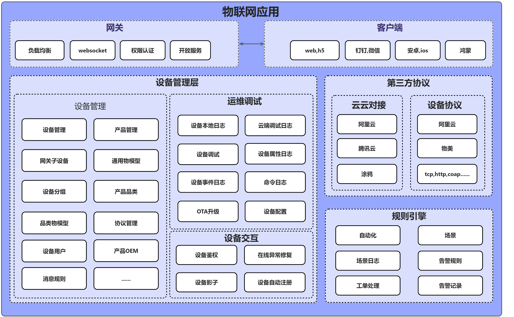
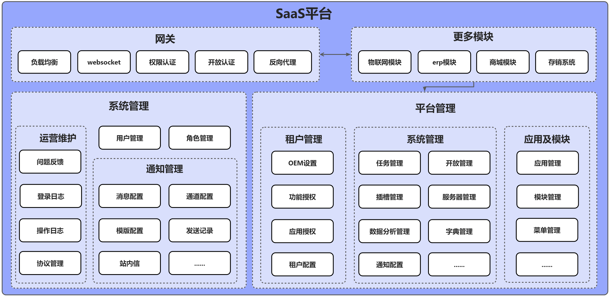
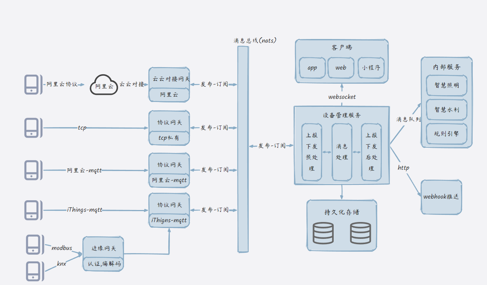
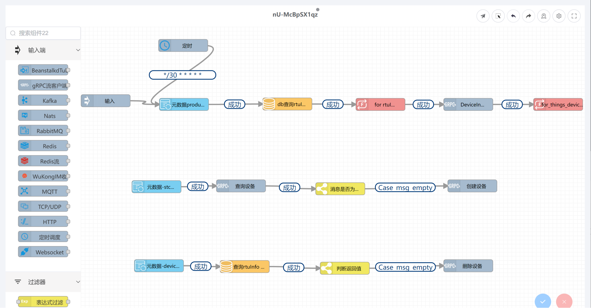
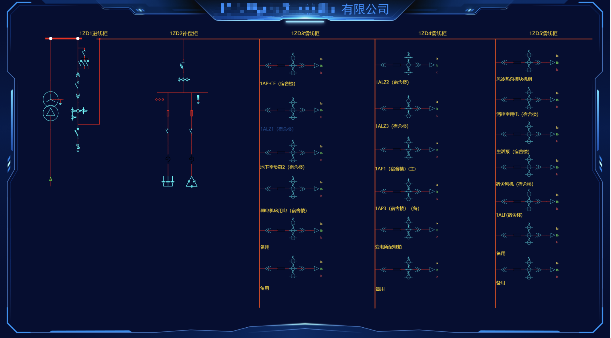
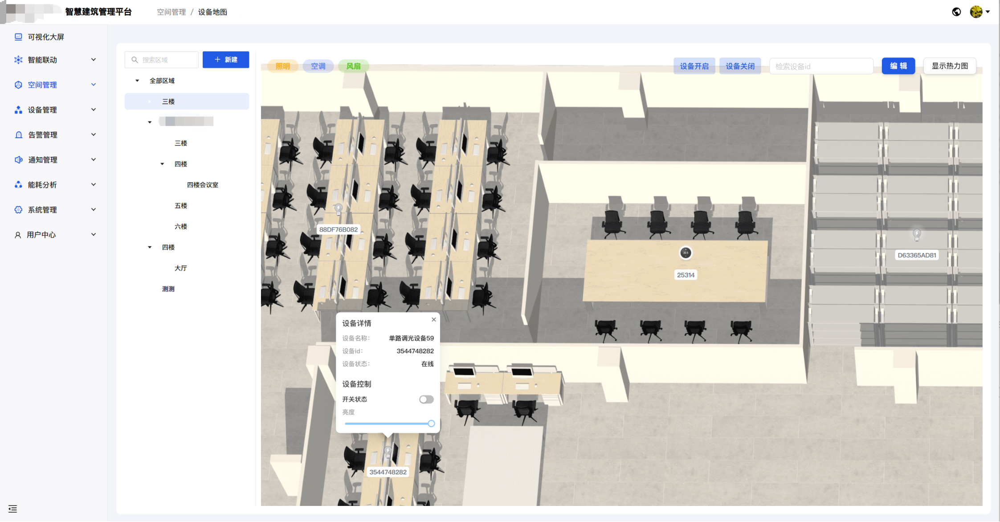
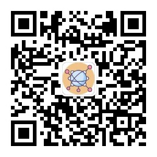

# UnitedRhino - Enterprise IoT Platform | IoT Foundation Platform

> 📖 [English](README.en.md) | [中文](README.md)

## 🚀 Enterprise IoT Platform

**UnitedRhino** is a commercial-grade **SaaS IoT platform** developed in Go, featuring **cloud-native microservices**, **edge computing** capabilities, and **multi-tenant architecture**. This **enterprise IoT platform** serves as an **IoT foundation platform**, providing complete **device management**, **real-time data analytics**, **comprehensive permission management system**, and **multi-scenario IoT solutions** capabilities, applicable to various scenarios such as **smart buildings**, **smart cities**, **smart energy**, **smart home**, **industrial IoT**, **smart agriculture**, **smart healthcare**, and more, reducing enterprise development costs by 80%.

### 🎯 Why Choose UnitedRhino IoT Platform?

- ✅ **Ready-to-Use IoT Solution**: Complete **Internet of Things platform**, no need to build from scratch
- ✅ **Cost-Effective Enterprise Platform**: Save 80% development costs compared to building your own **IoT platform**
- ✅ **Rapid IoT Deployment**: From project initiation to **connected devices** launch in just weeks
- ✅ **Comprehensive Permission Management**: Enterprise-grade **permission management system** with fine-grained access control
- ✅ **Continuous IoT Innovation**: Active open-source community with ongoing **IoT features** iterations

> 📖 [Complete IoT Documentation](https://doc.unitedrhino.com/) | 🌐 [Online IoT Demo](https://doc.unitedrhino.com/use/ezkveztg/)

---

## ✨ Core IoT Platform Features

### 🏢 Multi-tenant & Multi-project IoT Architecture
Supports **multi-tenant IoT solutions** and **multi-project management**, enabling low-cost custom **IoT project development** to meet different enterprises' personalized **connected device** needs. Supports multiple IoT application scenarios including **smart buildings**, **smart cities**, **smart energy**, **smart home**, **industrial IoT**, **smart agriculture**, and **smart healthcare**.

### 🔧 Flexible IoT Deployment
One **IoT platform codebase** supports **monolithic**, **microservices**, and **cluster deployment** modes, running on machines with as little as 2GB RAM, while supporting up to millions of **IoT devices**.

### ⚡ Quick IoT Integration
Default support for multiple **IoT protocols** (Alibaba Cloud IoT, Tencent Cloud IoT, Tuya IoT, Telecom IoT, Modbus IoT, etc.), with quick integration capabilities for various **IoT communication protocols** (MQTT, TCP, UDP, HTTP, LoRaWAN...).

### 📱 Ready-to-Use IoT Applications
Provides commercial-grade **IoT mini-programs** and **IoT mobile apps** that can be quickly launched through simple editing, without needing to develop **IoT applications** from scratch.

### 🛠️ Rapid IoT Development
Utilizes **micro-frontend technology** to create new **IoT modules** on the **SaaS IoT platform**, developing only differentiated frontend code, significantly improving **IoT development** efficiency. Can quickly build various IoT application scenarios such as **smart buildings**, **smart cities**, **smart energy**, **smart home**, **industrial IoT**, **smart agriculture**, and **smart healthcare**.

### 🌟 One-Stop IoT Foundation Solution
Full-stack **IoT solution** from **IoT device hardware/software** to **cloud IoT protocol integration** to **IoT web applications** and **mobile IoT apps**, covering the entire **IoT value chain**. As an **IoT foundation platform**, it can quickly build various IoT application scenarios including **smart buildings**, **smart cities**, **smart energy**, **smart home**, **industrial IoT**, **smart agriculture**, and **smart healthcare**.

### 🔌 Comprehensive IoT Platform Features
Flexible **OTA updates**, **IoT scene automation**, **IoT alarm management**, **IoT rule engine**, **IoT configuration dashboard**, **IoT thing models** (general thing model, product category thing model, product thing model, device thing model)...

### 🏗️ Powerful IoT Middle Platform
Complete **IoT notification mechanisms** (email, SMS, WeChat, WeCom, Feishu, DingTalk...), support for third-party user department synchronization, **enterprise-grade permission management system**, supporting fine-grained permission control, role management, data permission management, etc.

### 🌐 Edge Computing & Cloud Native
Advanced **edge computing** capabilities for **IoT edge devices**, **cloud-native IoT architecture** for seamless scaling, and **real-time IoT data processing**.

## 🏗️ IoT Platform Architecture

UnitedRhino **IoT platform** serves as a key intermediary and **IoT foundation platform** in **IoT architecture**, enabling efficient coordination between **IoT devices** and **IoT application layers**. It not only manages **connected IoT devices** downward, completing **IoT data collection** and **IoT data storage**, but also provides unified **IoT data interfaces** and **IoT development tools** upward for **IoT developers** and **IoT integrators**, accelerating multi-scenario **IoT solution development** and **IoT deployment** for **smart buildings**, **smart cities**, **smart energy**, **smart home**, **industrial IoT**, **smart agriculture**, and **smart healthcare**.

### IoT Module Architecture Design

### SaaS IoT Middle Platform Architecture Design

### IoT Deployment Architecture Diagram

## IoT Platform Demonstrations

### Low-Code IoT Platform

### IoT Configuration Dashboard

### IoT Device Map

## 💎 IoT Platform Value

| Platform Value | Description |
|---------|------|
| **Strong IoT Extensibility** | Supports **monolithic** and **microservice IoT architectures**, allowing **IoT developers** to flexibly switch between different development stages without maintaining two codebases |
| **High IoT Performance** | Developed in **Golang** with minimal third-party service dependencies, adaptable to various **IoT performance** requirements with quick horizontal scaling |
| **IoT Data Value** | **Private IoT deployment** with autonomous **IoT data management**, no concerns about public cloud service interruptions or cost issues |
| **IoT Foundation Platform** | Serves as a digital foundation for **multi-scenario IoT solutions**, supporting **smart buildings**, **smart cities**, **smart energy**, **smart home**, **industrial IoT**, **smart agriculture**, **smart healthcare** and other multi-industry shared **IoT platforms**, accumulating **IoT industry experience** and **IoT product solutions** |

## 🎖️ Who Uses Our IoT Platform? (Partial)

### IoT Partner Showcase

|   |   |   |
|---------|---------|---------|
|  Fujian Hechuang Network Technology Co., Ltd. |  Shenzhen Yibailong Technology Co., Ltd. |  Lianyuan Zhiwei |
|  Changzhou Feinuo Medical Technology Co., Ltd. |  Chongqing Tuhao Technology |  Hangzhou Weilixun |

## 🛠️ IoT Technology Stack

### IoT Backend Technology
- **IoT Microservice Framework**: [go-zero](https://go-zero.dev/) - High-performance **IoT microservice framework**
- **IoT High-Performance Cache**: [Redis](https://redis.io/) - In-memory **IoT data structure** store
- **IoT Message Queue**: [NATS](https://docs.nats.io/) - High-performance **IoT messaging system**
- **IoT Relational Database**: [MySQL/MariaDB](https://mariadb.com/) or PostgreSQL
- **IoT Service Registry**: [etcd](https://etcd.io/) (**IoT microservice** mode)
- **IoT Object Storage**: [MinIO](https://min.io/) or local storage, Alibaba Cloud, AWS - Cloud-native **IoT object storage**
- **IoT Time-Series Database**: [TDengine](https://www.taosdata.com/) or TimescaleDB - High-performance **IoT time-series data** processing
- **IoT MQTT Server**: [EMQX](https://docs.emqx.com/) or Comqtt - Distributed **IoT messaging server**

### IoT Frontend Technology
- **IoT Framework**: [Vue.js](https://vuejs.org/) - Progressive JavaScript **IoT framework**
- **IoT UI Components**: [Ant Design Vue](https://antdv.com/) - Enterprise-grade **IoT design components**

### IoT Mobile Technology
- **IoT Mini-Program**: [uni-app Vue3](https://uniapp.dcloud.net.cn/) - Cross-platform **IoT development framework**
- **IoT App**: [uni-app X](https://doc.dcloud.net.cn/uni-app-x/) - Supports Android, iOS, HarmonyOS for **IoT applications**

## 🚀 Quick Start IoT Platform

### 🎯 5-Minute IoT Platform Experience

Want to quickly experience UnitedRhino's powerful **IoT platform features**? We've prepared a complete **IoT demo environment** for you!

#### 🌟 Online IoT Demo Environment
No installation required, experience UnitedRhino's complete **IoT functionality** immediately

[🚀 Try IoT Platform Now](https://doc.unitedrhino.com/use/ezkveztg/)

### 📋 IoT Platform Requirements
- **Go**: 1.19+
- **IoT Database**: MySQL 5.7+ or PostgreSQL
- **IoT Cache**: Redis 6.0+
- **IoT Container**: Docker (optional, recommended)

### 🛠️ Quick IoT Platform Deployment

#### 📚 Detailed IoT Deployment Guide
From environment preparation to **IoT service** startup, step-by-step **IoT platform deployment** guide

[📖 View IoT Deployment Documentation](https://doc.unitedrhino.com/use/046431/)

### 💡 Having IoT Platform Issues?

- **📖 View IoT Documentation**: [Complete IoT Documentation](https://doc.unitedrhino.com/)
- **🐛 Submit IoT Issue**: [GitHub IoT Issues](https://github.com/unitedrhino/things/issues)
- **💬 Join IoT Community**: Scan QR code to join WeChat group for **IoT technical support**

#### 💡 Quick IoT Help
Encountering **IoT technical issues**? Our WeChat group has 500+ **IoT developers** ready to help!

**Scan QR code to join WeChat group → Get instant **IoT technical support****

## 💬 Contact IoT Platform Team

### 📱 IoT WeChat Community

> 💬 **Group already has 500+ IoT developers, looking forward to your joining!**

**Scan to join and start your **IoT journey**!**

### 📢 IoT Official Account

Follow our official account for more exciting **IoT content**:

### 📞 Other IoT Contact Methods

- **WeChat**: godLei6
- **IoT Website**: [https://doc.unitedrhino.com/](https://doc.unitedrhino.com/)
- **IoT GitHub Issues**: [Submit IoT Feedback](https://github.com/unitedrhino/things/issues)

## 🤝 IoT Open Source Community

- **IoT GitHub**: [UnitedRhino IoT GitHub](https://github.com/unitedrhino/things)
- **IoT Gitee**: [UnitedRhino IoT Gitee](https://gitee.com/unitedrhino/things)
- **IoT Website**: [UnitedRhino IoT Website](https://doc.unitedrhino.com/)

## 👥 IoT Contributors

Thanks to everyone who has contributed to our **IoT platform**!

## 💬 Join Our IoT Community

### 🎯 Why Join Our IoT Community?

- **🚀 Get Latest IoT Updates**: First to know about **IoT platform updates** and new **IoT feature** releases
- **💡 IoT Technical Exchange**: Deep technical discussions with **IoT experts** and **IoT developers**
- **🔧 IoT Problem Solving**: Having **IoT issues**? The **IoT experts** in the group are ready to help
- **🤝 IoT Resource Sharing**: Share **IoT technical documentation**, **IoT best practices**, and **IoT industry cases**
- **🎁 Exclusive IoT Benefits**: Group members enjoy **IoT technical support** and priority access to new **IoT features**
- **📈 IoT Career Development**: Network with **IoT industry** peers and expand professional connections

### 🌟 IoT Community Activities

- **Weekly IoT Technical Sharing**: Invite **IoT industry experts** to share cutting-edge **IoT technologies**
- **IoT Product Experience Officers**: Priority access to new **IoT features** and feedback opportunities
- **IoT Open Source Contributor Program**: Participate in **IoT open source projects** and earn exclusive recognition
- **IoT Offline Technical Salons**: Regular offline **IoT exchange** events

## ⭐ IoT Platform Star History

> 💡 **Note**: For latest **IoT platform** version updates, please visit: [Gitee](https://gitee.com/unitedrhino/things)

## 📄 IoT Platform License

This **IoT platform** project is licensed under the [Apache License 2.0](LICENSE).

---

## 🚀 Start Your IoT Platform Journey

If this **IoT platform** project helps you, please give us a ⭐ Star

💬 Join our **IoT community** and learn together with 500+ **IoT developers**

[⭐ Star IoT Platform on GitHub](https://github.com/unitedrhino/things) | [⭐ Star IoT Platform on Gitee](https://gitee.com/unitedrhino/things)

*Made with ❤️ by UnitedRhino IoT Team*
