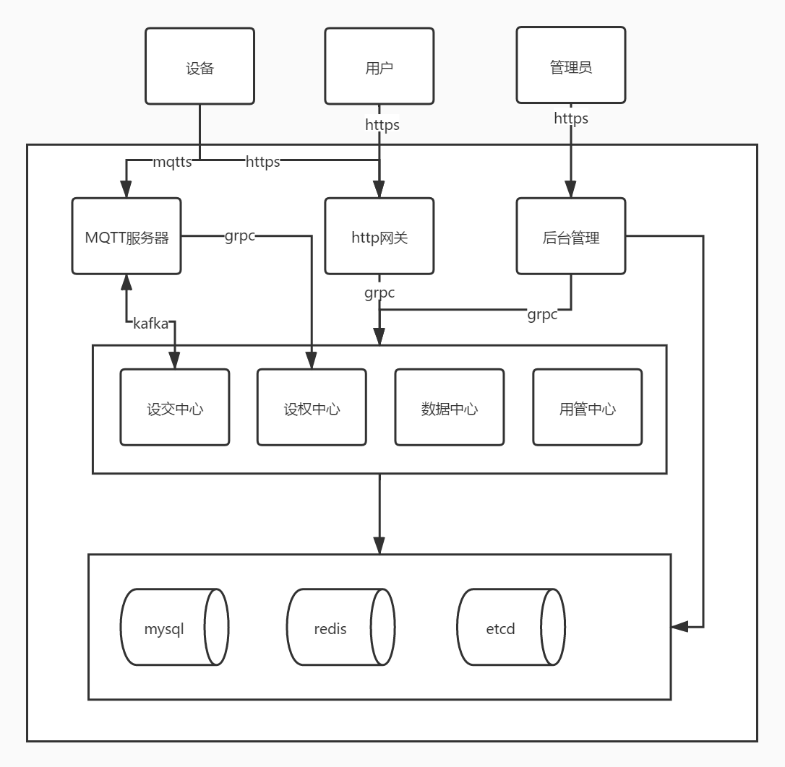

# 物联网云平台go-things

## 介绍

依照腾讯云物联网平台打造,无缝迁移,基于go-zero框架,目前支持mqtt协议,支持数据模板检验,日志记录,数据流转,实时数据反馈,低代码数据流转,用户及设备互联互通.使用了kafka,redis,mysql,MongoDB,etcd开源框架.

## 架构
下图是 Things 平台的整体架构:

## 目录

- doc:该项目的文档都放在这里
- shared:所有该项目及其他项目所公用的代码都放在这里
- src:存放了所有服务的源码

## 安装
### 依赖安装
在go-things中依赖mongodb,mysql,redis,etcd,kafka,zookeeper
* 在初始目录中提供了docker-compose文件,如果安装好了docker及docker-compose可以直接
docker-compose up 即可更新
* 如果都没有安装则sudo ./init.sh即会安装docker及docker-compose及第三方依赖
* 然后将db中的sql导入mysql中即可

### 服务运行
1. 进入src目录进入对应的服务
2. 修改etc目录下的配置文件将对应的依赖改为本地的ip地址
3. 直接go build即可享受

## 文档

- 开发文档: https://go-things.github.io
- 用户文档: https://go-things.github.io

## 贡献

1.  Fork 本仓库
2.  新建 Feat_xxx 分支
3.  提交代码
4.  新建 Pull Request

## 社区
- 微信: `godLei6` (需备注“来自github”)
- 官网:[https://i.github.io](https://ithings.github.io)
