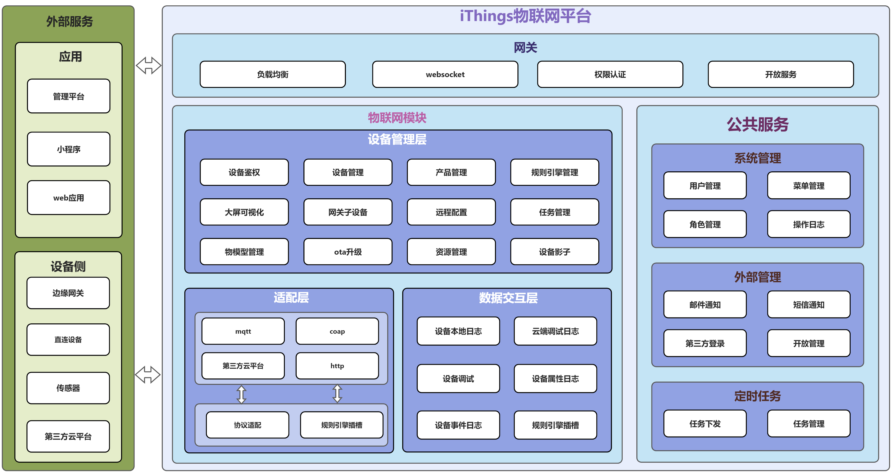
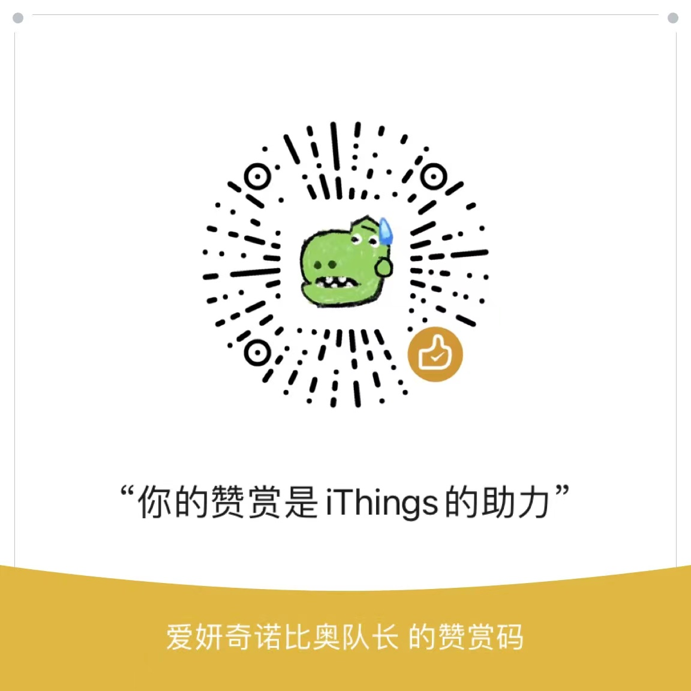

# 物联网云平台ithings

iThings是一个基于golang开发的轻量级云原生微服务物联网平台.

定位于:

* 高性能 -- 使用golang编写,选用高性能组件(emqx,nats,tdengine),基于gozero微服务框架高性能的同时保证服务的稳定性
* 云原生易拓展 -- 一套代码同时支持k8s,docker,微服务及单体模式部署,便于业务从单体到微服务的切换
* 易部署 -- 一键安装所有依赖,一键运行iThings
* 易集成 -- 可以通过http,grpc,甚至直接将iThings作为包集成进自己系统

git地址:

* 后端github地址:[https://github.com/i4de/ithings](https://github.com/i4de/ithings)
* 后端gitee地址:[https://gitee.com/i-Things/things](https://gitee.com/i-Things/things)
* 前端github地址:[https://github.com/i4de/iThings-admin-react](https://github.com/i4de/iThings-admin-react)

## 产品架构

iThings物联网平台提供跨不同设备和数据源的通用接入及管理平台,在整个物联网架构中起到承上启下的中介作用，
联动感知层及应用层之间的所有交互——向下连接、管理物联网设备端并完成感知数据的归集与存储，
向上为应用开发商与系统集成商提供应用开发的统一数据接口及共性模块工具。应用厂商可以通过http,grpc,及golang包引入的方式快速集成进自己的系统中,迅速获取物联网平台的能力,轻量而高效.

- 

## 产品价值

| 平台价值     | 描述                                                                                                                                                          |
| ------------ | ------------------------------------------------------------------------------------------------------------------------------------------------------------- |
| 拓展能力强   | 公司发展有不同的阶段,应用场景也有不同的需要,iThings同时支持单体和微服务便于开发者不需要维护两套代码同时单体不足以满足公司需要时也可以很便捷的切换为微服务架构 |
| 高性能       | 使用golang开发,依赖的第三方服务很少,对于性能要求不高的场景甚至可以部署到低性能的arm上                                                                         |
| 数据价值     | 私有化部署,所有数据都可以自己去管理,不用担心公有云停服及收费高的问题                                                                                          |
| 解决方案底座 | 可做为行业解决方案的数字底座，支持多行业解决方案共用同一个物联网平台底座，为企业沉淀更多行业经验和产品方案。                                                  |

## 产品特性

* 设备接入：通过行业标准物联网协议（MQTT、CoAP 和 HTTP）实现海量设备连接,也可以通过规则引擎接入自定义协议。
* 远程控制：使用http api可以实现服务器对设备的精准控制和设备主动向服务器发送请求通知。
* 物模型：支持标准物模型,有效管理设备的属性,事件及行为。
* RBAC权限：权限控制采用 RBAC，基于角色的访问控制。封装完善的用户、角色、菜单等基础权限功能。
* 应用支撑：提供http,grpc或golang直接导入包的形式将数据流转至业务层面，屏蔽了物联网层面的复杂特性，让企业专注业务应用开发，缩短物联网解决方案的上市周期，为企业节省大量研发时间和成本。
* 自主可控：私有云、公有云、边缘部署.
* 快速开发及维护: 提供设备云端调试日志,设备本地日志,在线设备调试 快速开发及调试问题

## 产品功能

| 功能       | 描述                                                                               |
| ---------- | ---------------------------------------------------------------------------------- |
| 后台管理   | 独立后台,提供用户管理,角色管理,菜单管理                                            |
| 设备管理   | 包含设备信息维护、数据收集等基础功能，支持设备参数配置、模型配置、在线调试等功能。 |
| 产品管理   | 支持产品管理,物模型管理,远程配置管理                                               |
| 设备分组   | 支持设备最多三级分组                                                               |
| 网关子设备 | 完整网关子设备功能                                                                 |

## 技术架构

### 后端架构

#### 技术栈

1. 微服务框架:[go-zero](https://go-zero.dev/)
2. 高性能缓存:[redis](https://redis.io/)
3. 高性能消息队列:[nats](https://docs.nats.io/)
4. 关系型数据库:`mysql`
5. 微服务注册中心(单体可不使用):`etcd`
6. 云原生轻量级对象存储:[minio](https://min.io/)
7. 开源、高性能、云原生,极简的时序数据处理平台:[tdengine](https://www.taosdata.com/)
8.

大规模可弹性伸缩的云原生分布式物联网MQTT消息服务器:[emqx](https://docs.emqx.com/zh/enterprise/v4.4/getting-started/install-ee.html)

### 代码结构

> [src模块简介、编译及启动方式.readme.md](./src/README.md)

```shell
- deploy #部署时 相关配置
  - conf
    - emqx #mtqq组件 相关配置
      - data
        - loaded_plugins
      - etc
        - plugins
          - emqx.conf #mtqq组件 主要服务配置文件
          - emqx_auth_http.conf #mtqq组件 鉴权服务配置文件
    - ithings #本项目服务 相关配置
      - apisvr
        - etc #部署时 各服务 配置文件
          - api.yaml #api网关接口代理模块配置
          - dd.yaml #设备数据处理模块配置
          - di.yaml #设备交互模块配置
          - dm.yaml #设备管理模块配置
          - sys.yaml #系统管理模块配置
    - mysql #本项目SQL文件
      - sql
        - dmsvr.sql #设备管理模块SQL
        - rulesvr.sql #协议规则引擎模块SQL
        - syssvr.sql #系统管理模块SQL
    - nats #nats组件 相关配置
      - nats-server.conf # #nats配置文件

- doc #项目文档
  - assets #一些逻辑流程图、架构图、二维码
  - v2 #v2版本架构设计思路

- shared #公共服务、DTO、Client
  - clients #mqtt/nats/TDengine client
  - conf #配置文件内 部分对象的 DTO
  - def #常量、结构体 通用定义
  - devices #此负责提供 和设备相关的 公用的操作函数
  - domain #此包用于封装 跨服务共享的 领域对象
    - application #此包负责定义 应用层推送的 结构体
    - deviceAuth
    - schema #此包负责 物模型定义及相关逻辑
  - errors #程序错误对象、错误码的定义
  - events #此包负责提供事件的封装及解包（如topic、常量、结构体、封解方法）
  - oss #对象存储SDK
  - proto #公共proto定义
  - result #apisvr网关模块 响应结果处理 的封装
  - store
  - third #第三方SDK对接
  - traces #链路追踪方法封装
  - users #jwt方法封装
  - utils #工具类函数封装
  - verify #验证码函数封装

- src #项目主要代码（go-zero rest）
  - apisvr #api网关接口代理模块
    - etc #单体部署 运行时 各服务 配置文件
      - api.yaml #api网关接口代理模块配置
      - dd.yaml #设备数据处理模块配置
      - di.yaml #设备交互模块配置
      - dm.yaml #设备管理模块配置
      - sys.yaml #系统管理模块配置
    - apidirect
      - direct.go #加载配置、协程启动dd服务、构造单例上下文（含根据配置判断连接其他子服务）
  - ddsvr #设备数据处理模块（go-zero rest）
    - etc
      - dd.yaml #独立部署 运行时 当前服务 配置文件
    - dddirect
      - direct.go #加载配置、构造单例上下文、注册消费者Handle
  - disvr #设备交互模块（go-zero rpc）
    - etc
      - di.yaml #独立部署 运行时 当前服务 配置文件
    - didirect
      - direct.go #加载配置、构造单例上下文、注册消费者Handle
  - dmsvr #设备管理模块（go-zero rpc）
    - etc
      - dm.yaml #独立部署 运行时 当前服务 配置文件
    - dmdirect
      - direct.go #加载配置、构造单例上下文
  - rulesvr #协议规则引擎模块（go-zero rpc）
    - etc
      - rule.yaml #独立部署 运行时 当前服务 配置文件
    - ruledirect
      - direct.go #加载配置、构造单例上下文、注册消费者Handle
  - syssvr #系统管理模块（go-zero rpc）
    - etc
      - sys.yaml #独立部署 运行时 当前服务 配置文件
    - sysdirect
      - direct.go #加载配置、构造单例上下文

- tests #单元测试用例
```

### 接口文档

- apisvr: https://www.apifox.com/apidoc/shared-1424696c-bc32-4678-83c0-6ff9f72c4f24/api-13581481

### 本地运行步骤

- 部署 需要的 组件服务，如 mysql、redis、nats、etcd、TDengine 等待，详见`ithings\src\apisvr\etc\*.yaml` 下的配置文件内容
- 创建数据库`iThings`，并执行目录`ithings/deploy/conf/mysql/sql/`下所有SQL
- 修改`IDE`工作目录为`ithings\src\apisvr`, 然后运行 `ithings/src/apisvr/api.go` 的 `main` 函数

### 前端架构

#### 技术栈

1. 用于构建用户界面的 JavaScript 库:[react](https://reactjs.org/)
2. 企业级设计组件:[ant design](https://ant.design/)
3. 一套高质量可靠的 React Hooks库:[ahooks](https://ahooks.js.org/)

## 贡献者

感谢所有已经做出贡献的人!

### 后端

<a href="https://github.com/i4de/iThings/graphs/contributors">
  
</a>

### 前端

<a href="https://github.com/i4de/iThings-admin-react/graphs/contributors">
  
</a>

## 社区

- 微信(加我拉微信群): `godLei6` (需备注“来自github”)
- QQ群(需备注“来自github”): <a href="https://jq.qq.com/?_wv=1027&k=1J4ZL7mn">776725046</a>
- [官网](http://ithings.net.cn/) 
- 时刻招募相信分布式办公的你
- 微信二维码
- 

## 赞赏

- 如果iThings对你有帮助或者有启发,欢迎赞赏,这是对我们的认可及动力
- 

## 收藏


