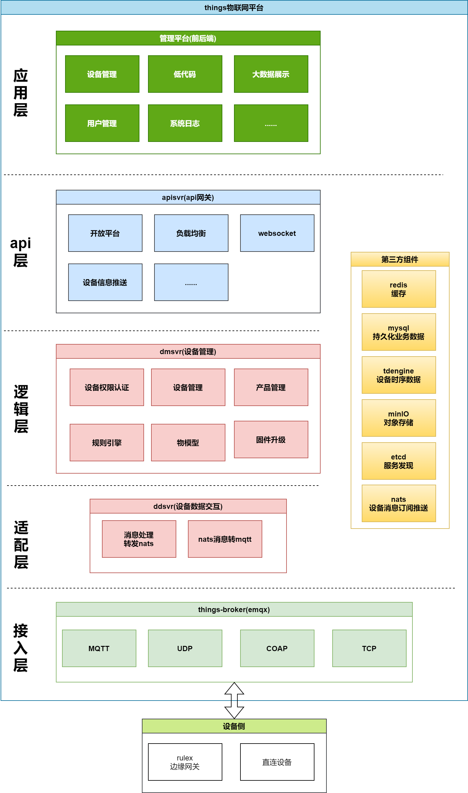

# 物联网云平台ithings

## 介绍

iThings是一个基于golang开发的轻量级云原生微服务物联网平台.  
  
定位于:
* 云原生高性能 -- 使用golang编写,使用gozero微服务框架高性能的同时保证服务的稳定性
* 易拓展 -- 原生支持微服务部署,避免只支持集群模式后期难以拓展的尴尬
* 易部署 -- 一键安装所有依赖,一键运行iThings
* 
## 架构
下图是 iThings 平台的整体架构:

#### 目录说明

- doc:该项目的文档都放在这里
- shared:所有该项目及其他项目所公用的代码都放在这里
- src:存放了所有服务的源码

## 特征

### 已完成
1. 物模型的管理及校验初始化
2. 物模型数据属性,事件及行为的持久化
3. 物模型数据展示
4. 设备操作日志记录
5. 产品管理
6. 设备管理及认证
7. 设备消息回复及处理
### 待实现
1. 固件升级
2. 规则引擎
3. 网关型设备接入
4. websocket
5. 单机模式
6. 低代码

## 安装
### 依赖安装
在ithings中依赖tdengine,mysql,redis,etcd,nats,emqx
* sudo ./init.sh即会安装docker及docker-compose及第三方依赖及初始化数据库脚本(一定是root权限,不然可能会有问题)
* 然后 ./run.sh 即可运行iThings所有服务
### 服务运行
1. 进入src目录进入对应的服务
2. 修改etc目录下的配置文件将对应的依赖改为本地的ip地址
3. 直接go build即可享受

## 文档

- 开发文档: [https://ithings.pages.dev/](https://ithings.pages.dev/)
- 用户文档: [https://ithings.pages.dev/](https://ithings.pages.dev/)

## 贡献

1.  Fork 本仓库
2.  新建 Feat_xxx 分支
3.  提交代码
4.  新建 Pull Request

## 社区
- 微信: `godLei6` (需备注“来自github”)
- 官网:[https://ithings.pages.dev/](https://ithings.pages.dev/)

## 收藏
