# 联犀 UnitedRhino — AIoT 原生企业数字化平台

> 📖 [中文](README.md) | [English](README.en.md)

联犀把 SaaS、IoT、知识库、Skills、MCP、Sandbox 与语音入口组织成统一的 AIoT 原生底座，让原本只有大厂才能长期建设的 AI 平台能力，成为所有企业都能使用的基础能力。

本仓库是联犀平台的**核心后端服务**，基于 Go（go-zero 微服务框架）实现设备接入、物模型、规则引擎、告警、音视频、物联卡等核心能力，支持单体、微服务与集群部署，最低 2G 内存即可运行，最高可支撑百万级设备接入。

> 📖 [完整文档](https://doc.unitedrhino.com/) | 🌐 [在线体验](https://doc.unitedrhino.com/use/ezkveztg/) | 💰 [版本定价](https://doc.unitedrhino.com/use/68b74b/)

---

## ✨ 核心能力

### 🔌 设备接入与协议兼容
内置 MQTT Broker 与 13 个协议适配器，兼容阿里云、腾讯云、Modbus 等主流生态；Go 脚本引擎支持自定义协议转换，新协议可复制模板快速接入。

### 📊 物模型与时序数据
从通用物模型到设备级物模型的四层定义，配合 TDengine 时序存储与异步批量写入，支撑从接入到分析的数据闭环。

### 🔗 场景联动与告警
规则引擎支撑设备间自动联动；告警覆盖规则配置、事件收敛与站内信、短信、钉钉、企微等 9 渠道通知。

### 🎥 音视频流媒体
自研 GB28181 SIP 服务 + ONVIF + ZLMediaKit，WebRTC/HLS 实时监控、云台巡航、云录像与设备端录像回放，不依赖第三方视频云。[查看文档](https://doc.unitedrhino.com/use/25.音视频/)

### 💳 物联卡全托管
移动/联通/电信三运营商通道接入，卡生命周期、资费套餐、流量对账、智能诊断与批量运维一站完成。[查看文档](https://doc.unitedrhino.com/use/26.物联卡/)

### 📺 组态大屏与低代码
拖拽式可视化引擎，IoT 物模型数据直绑、8 类数据集与模板市场，配套规则链低代码编排。[查看文档](https://doc.unitedrhino.com/use/01.快速开始/04.组态大屏/)

### 🧠 AI 中台与知识库
AI 不是外挂聊天框，而是平台主能力：Agent 运行时、知识库与 Skills 沉淀业务经验，小智语音与音色克隆把 AI 延伸到终端。

### 🛠️ MCP 工具接入
通过 MCP 重新组织设备、系统与外部服务能力，AI 可直接查询设备状态、下发控制指令，而不是面对一堆底层接口。

### ☁️ Sandbox 与云端 Claw
控制面与执行面分离，受控 workspace 与资源治理让 AI 执行具备上线条件；个人侧、本地侧与云端侧 AI 统一接入运行。

## 🏗️ 平台架构

从设备接入到 AI 应用，联犀在同一套底座上完成数据上行与指令下行的完整闭环：

- **用户入口**：Web 控制台、小程序 / App（安卓 / iOS / 鸿蒙）、钉钉 / 微信、开放 API 与 MCP、联犀 CLI、小智语音
- **网关**：负载均衡、WebSocket、权限认证、开放服务、反向代理
- **应用层**：物联网应用、行业应用（智慧能源、智慧楼宇、智慧城市、结构监测、智慧农业等）、系统管理
- **能力中台**：AI 中台、IoT 底座、通用底座
- **接入层**：IoT 设备与网关、摄像头 / NVR、语音终端、第三方平台
- **基础设施**：PostgreSQL、TDengine、Redis、NATS、MQTT Broker、RustFS、etcd

### 平台总体架构

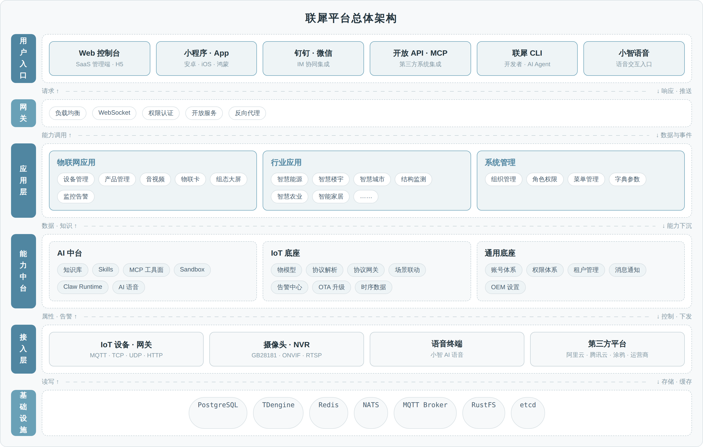

### AI 能力架构

控制面组织会话、Agent、知识与技能装配；工具面承接 Skills、MCP、CLI 与前后端 tools；执行面由 Claw Runtime 与 Sandbox 提供受控执行；应用面承接 SaaS、IoT 与语音等入口。

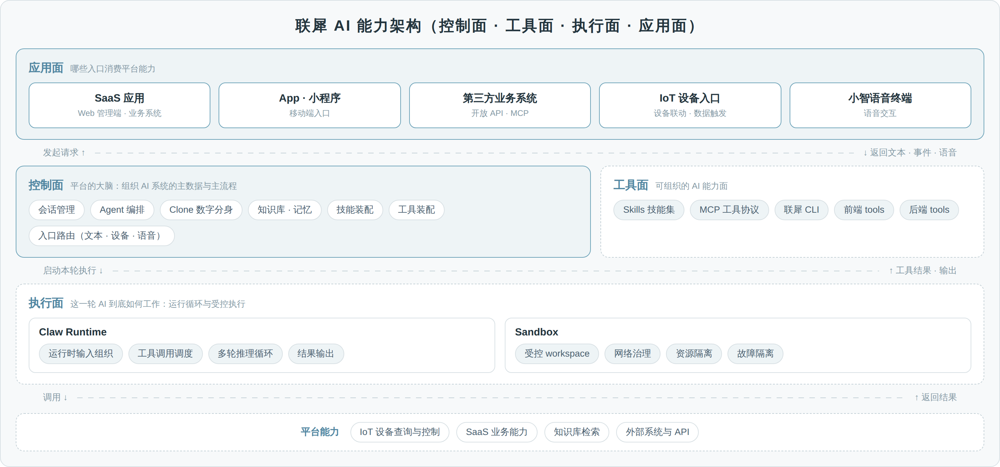

### 设备接入与数据流转架构

多协议设备经协议网关接入，通过 NATS 消息总线进入设备管理服务的消息处理管道，最终流向客户端、规则引擎与持久化存储。

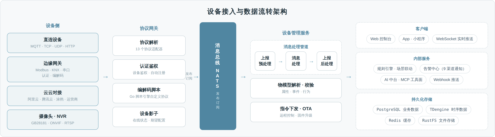

## 📸 产品截图

### 低代码平台

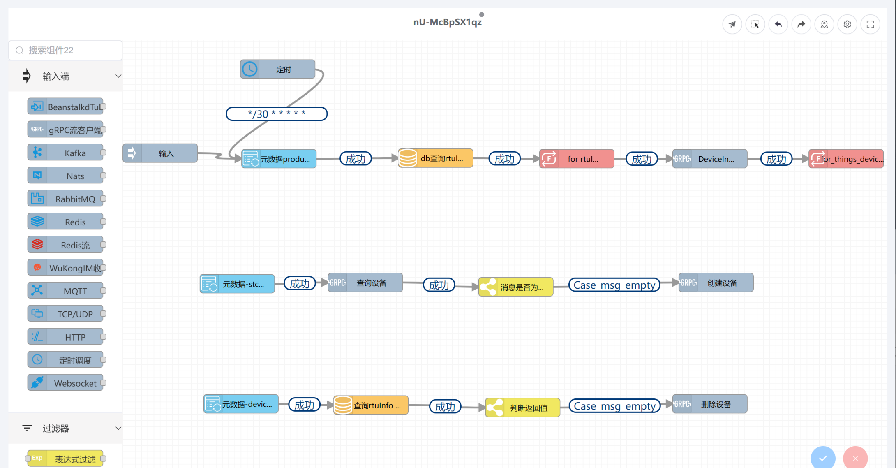

### 组态大屏

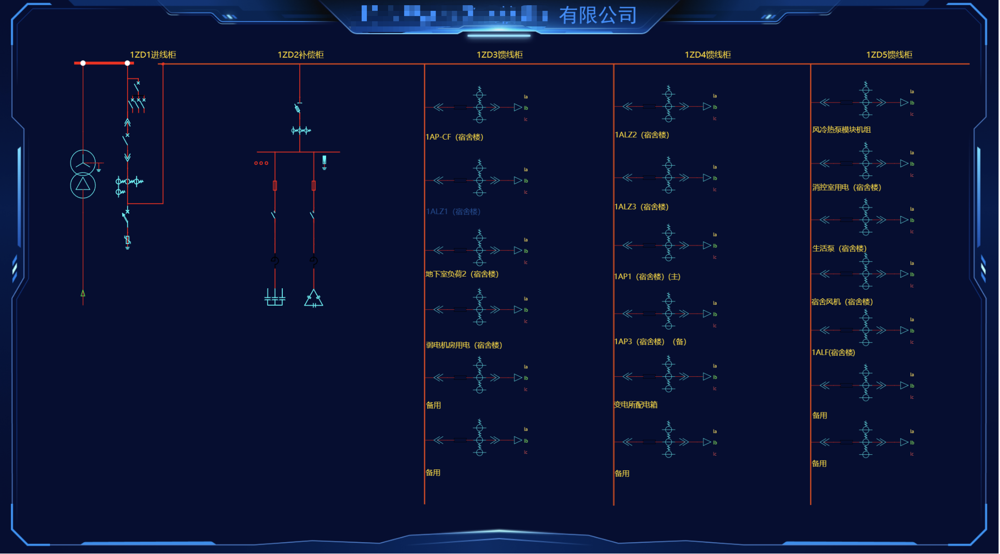

### 设备地图

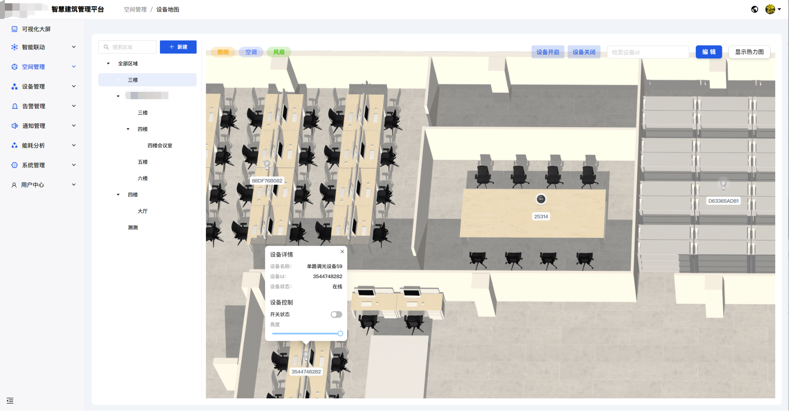

## 🎯 案例展示

联犀已在能源、家居、照明、工业、水利与地质监测等场景落地，以下案例均基于同一套平台底座交付：

| 智慧能源 | 智能家居 |
|---------|---------|
| [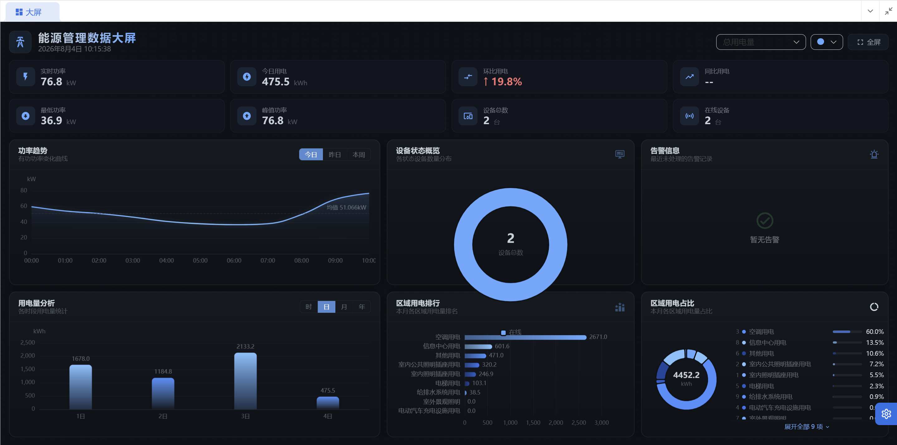](https://doc.unitedrhino.com/cases/e9f4a2/) | [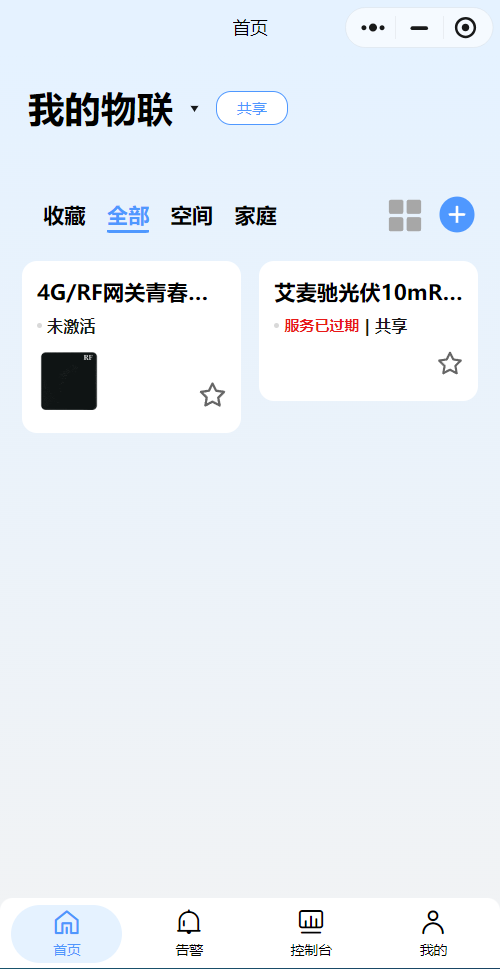](https://doc.unitedrhino.com/cases/e3a9f1/) |
| 园区与企业用能管理：能耗分析、电力集抄、预付费与能源数据大屏，实时掌握用能全貌。[查看案例 →](https://doc.unitedrhino.com/cases/e9f4a2/) | 家庭智能化：多协议门控接入、空间管理、场景联动与家人共享协作。[查看案例 →](https://doc.unitedrhino.com/cases/e3a9f1/) |

| 智慧照明 | 结构监测 |
|---------|---------|
| [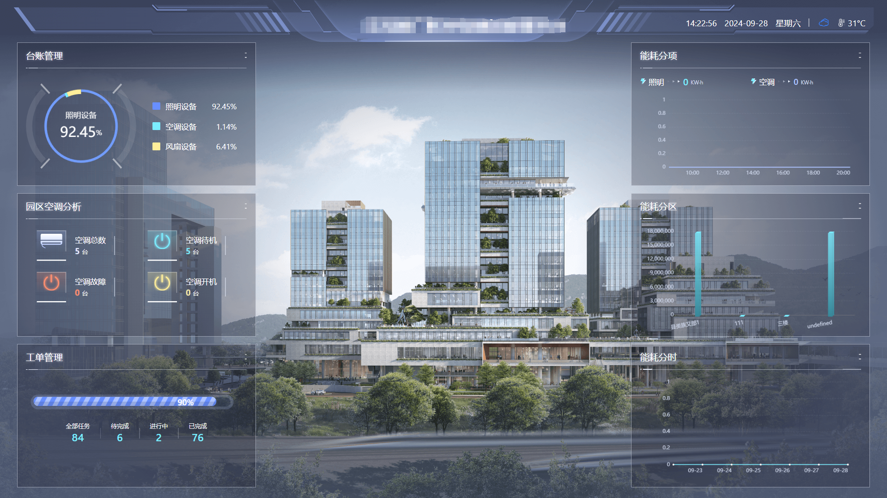](https://doc.unitedrhino.com/cases/15c21a/) | [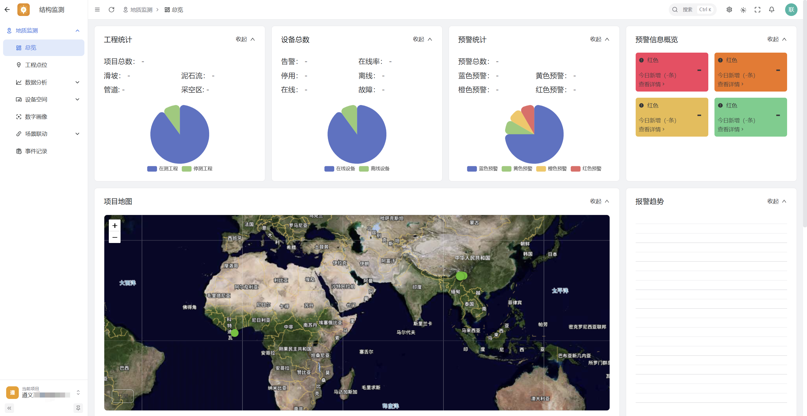](https://doc.unitedrhino.com/cases/geo-mon/) |
| 楼宇照明与空调智能化：数据大屏、能源分析、设备地图、一键场景与自动化告警，配套小程序端。[查看案例 →](https://doc.unitedrhino.com/cases/15c21a/) | 地质与结构安全监测：GNSS 位移/应力/裂缝/振动传感器接入，蓝黄橙红四级预警与数字画像。[查看案例 →](https://doc.unitedrhino.com/cases/geo-mon/) |

| 工业自动化 | 智能水泵 |
|---------|---------|
| [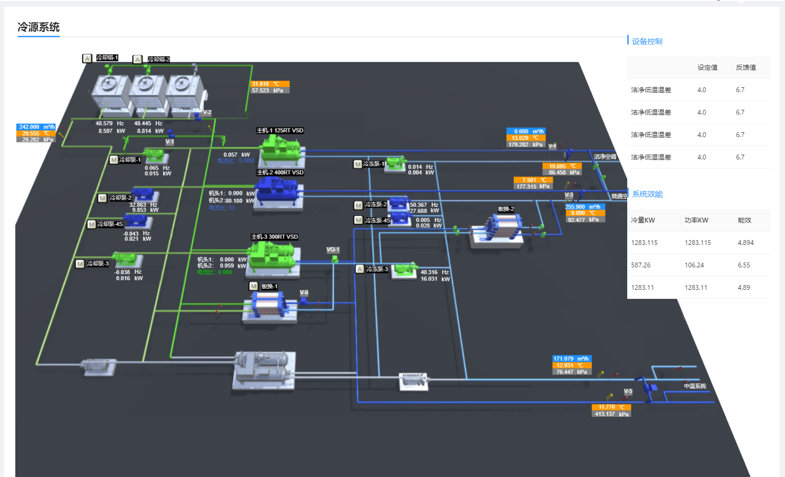](https://doc.unitedrhino.com/cases/82fa55/) | [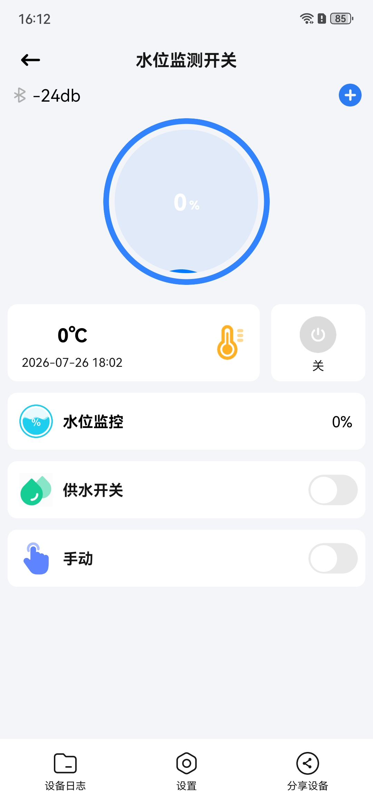](https://doc.unitedrhino.com/cases/c4d7e2/) |
| 工业现场能耗管理：组态画面、数据总览与视频监控一体化呈现。[查看案例 →](https://doc.unitedrhino.com/cases/82fa55/) | 牧场与农田户外供水：水位监测、水泵远程控制与阈值自动化，移动端实时掌控。[查看案例 →](https://doc.unitedrhino.com/cases/c4d7e2/) |

| 智能光伏 | 安防监控 |
|---------|---------|
| [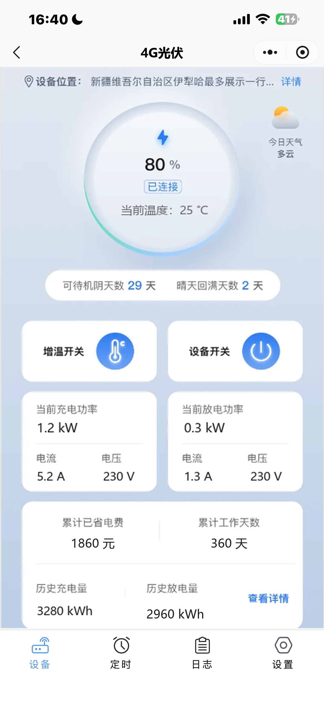](https://doc.unitedrhino.com/cases/d8e6f1/) | [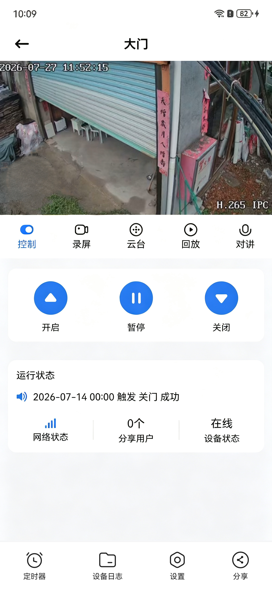](https://doc.unitedrhino.com/cases/9d4e82/) |
| 偏远地区离网光伏储能：4G 终端接入、充放电监测与远程设备控制。[查看案例 →](https://doc.unitedrhino.com/cases/d8e6f1/) | 别墅与园区出入口安防：IPC 摄像机接入、实时预览、云台控制、双向对讲、录像回放与门体遥控一体。[查看案例 →](https://doc.unitedrhino.com/cases/9d4e82/) |

更多案例（智能风扇、智慧农业等）请见 👉 [案例库与成果展示](https://doc.unitedrhino.com/cases/2cb8e9/)

## 💎 平台价值

| 平台价值 | 描述 |
|---------|------|
| **强大的扩展能力** | 支持单体和微服务架构，便于开发者在不同发展阶段灵活切换，无需维护两套代码 |
| **高性能** | 使用 Golang 开发，依赖的第三方服务少，适应多种性能要求，可以快速水平扩展 |
| **数据自主可控** | 私有化部署与自主数据管理，无需担心公有云服务中断或成本问题 |
| **多场景数字底座** | 支持智慧能源、智能家居、智慧照明、工业、水利、安防等多行业共用，沉淀行业经验与产品方案 |

## 🎖️ 谁在使用（部分）

|   |   |   |
|---------|---------|---------|
|  福建合创网络科技有限公司 |  深圳市易百珑科技有限公司 |  联远智维 |
|  常州飞诺医疗技术有限公司 |  重庆图浩科技 |  杭州伟立讯 |

## 🛠️ 技术栈

### 后端
- **微服务框架**: [go-zero](https://go-zero.dev/)
- **缓存**: [Redis](https://redis.io/)
- **消息队列**: [NATS](https://docs.nats.io/)
- **关系型数据库**: [MySQL/MariaDB](https://mariadb.com/) 或 PostgreSQL
- **服务注册中心**: [etcd](https://etcd.io/)（微服务模式）
- **对象存储**: S3 兼容对象存储（生产环境使用 [RustFS](https://rustfs.com/)，兼容 MinIO），亦支持本地存储、阿里云 OSS、AWS S3
- **时序数据库**: [TDengine](https://www.taosdata.com/) 或 TimescaleDB
- **MQTT 服务器**: [EMQX](https://docs.emqx.com/) 或 comqtt

### 前端
- **框架**: [Vue.js](https://cn.vuejs.org/)
- **UI 组件**: [Ant Design Vue](https://antdv.com/)

### 移动端
- **小程序**: [uni-app Vue3](https://uniapp.dcloud.net.cn/)
- **App**: [uni-app X](https://doc.dcloud.net.cn/uni-app-x/)（支持安卓、iOS、鸿蒙）

## 🚀 快速开始

### 在线体验

无需安装，立即体验联犀的完整功能：

[🚀 立即体验](https://doc.unitedrhino.com/use/ezkveztg/)

### 一键接入 AI

让 AI 直接操控联犀平台，自动完成 CLI 安装、认证与 Skills 部署：

[🤖 本地 AI 安装教程](https://doc.unitedrhino.com/use/01.快速开始/09.本地AI安装教程/)

### 环境要求

- **Go**: 1.19+
- **数据库**: MySQL 5.7+ 或 PostgreSQL
- **缓存**: Redis 6.0+
- **容器**: Docker（可选，推荐）

### 部署指南

从环境准备到服务启动，一步步带你完成部署：

[📖 查看部署文档](https://doc.unitedrhino.com/use/046431/)

## 🤝 开源社区

- **GitHub**: [unitedrhino/things](https://github.com/unitedrhino/things)
- **Gitee**: [unitedrhino/things](https://gitee.com/unitedrhino/things)
- **联犀 CLI**: [GitHub](https://github.com/unitedrhino/cli) | [Gitee 镜像](https://gitee.com/unitedrhino/cli) — 命令行操控平台，供开发者与 AI Agent 使用
- **官网与文档**: [doc.unitedrhino.com](https://doc.unitedrhino.com/)

感谢所有 [贡献者](https://github.com/unitedrhino/things/graphs/contributors)！项目收藏趋势见 [Star History](https://starchart.cc/unitedrhino/things)。

## 💬 联系我们

### 微信交流群

> 💬 群内已有 500+ 开发者，扫码加入，获得即时技术支持（加微信拉群）

### 公众号

关注公众号，获取最新版本动态与实践分享：

### 其他联系方式

- **微信**: godLei6
- **问题反馈**: [GitHub Issues](https://github.com/unitedrhino/things/issues)

## 📄 许可证

本项目采用 [Apache License 2.0](LICENSE) 开源许可证。

---

如果这个项目对您有帮助，请给我们一个 ⭐ Star

[⭐ Star on GitHub](https://github.com/unitedrhino/things) | [⭐ Star on Gitee](https://gitee.com/unitedrhino/things)

*Made with ❤️ by 联犀团队*
