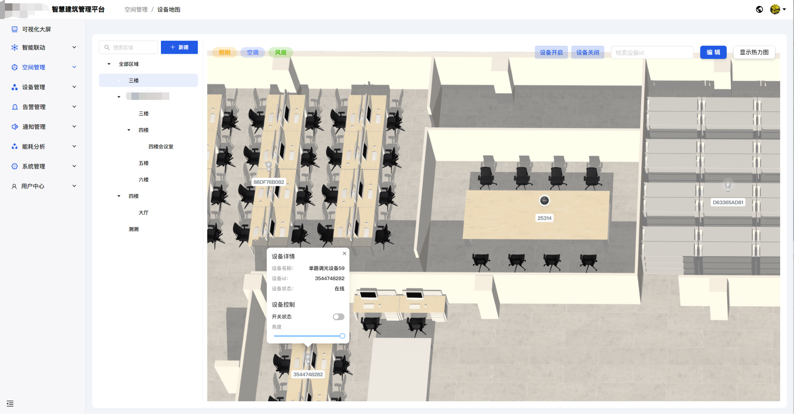
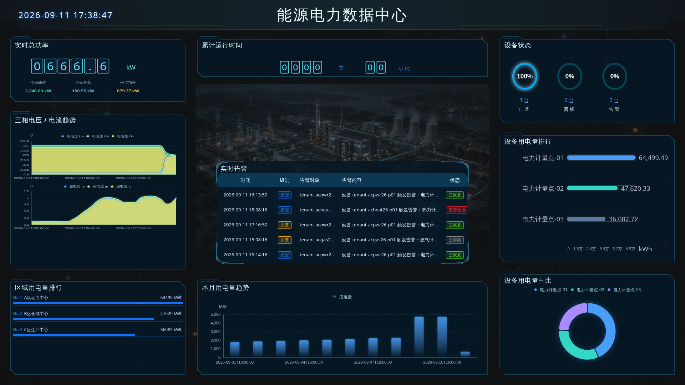
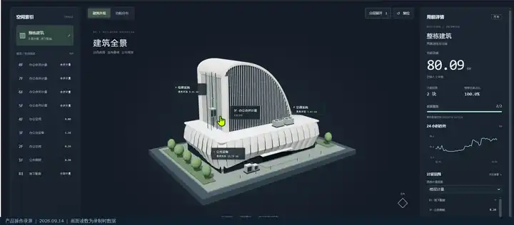
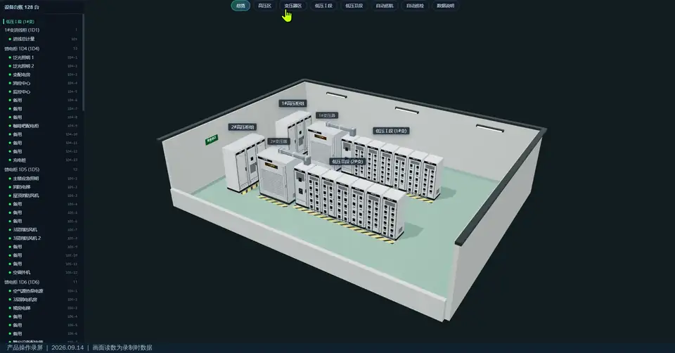

# 联犀 Things · 开源物联网模块

[English](./README.en.md) · 中文

**快速接入设备，拥有自己的 AI 应用，进一步构建自己的 SaaS 与智能产品。**

> **企业版永久免费私有化部署，不限制用户数量，不限制设备数量。**
>
> 可部署在自己或客户的服务器，用于实际商业项目。免费指企业版平台软件使用，不包含源码授权、服务器资源、行业应用授权和人工服务；实际承载能力取决于部署资源与配置。SaaS 托管套餐另有资源配额，不与私有部署混用。

[访问联犀官网](https://www.unitedrhino.com/zh-CN/) · [免费部署企业版](https://doc.unitedrhino.com/use/046431/) · [在线体验](https://www.unitedrhino.com/zh-CN/pricing/#saas-experience)

[⭐ Star on GitHub](https://github.com/unitedrhino/things) · [⭐ Star on Gitee](https://gitee.com/unitedrhino/things)

## 你可以用联犀做什么

联犀融合物联网、AI 与多企业应用能力。复用设备接入、数据管理、知识与业务工具、企业与应用权限，把开发投入留给自己的行业流程和品牌体验。

以下是推荐路径，不是使用门槛：已有设备、资料或业务系统，也可以直接从 AI 应用或产品开发开始。

### 1. 快速接入设备：把资料交给你自己的 AI

用 WorkBuddy 等熟悉的 AI 工具，借助联犀 Skills 与 CLI 提供接入方法和授权操作能力：

1. **提供资料**：告诉 AI 要接入什么设备，给它说明书、协议或已有报文。
2. **授权接入**：完成本人授权和设备联网，让 AI 协助配置产品、设备与数据字段。
3. **检查调试**：看接入结果；遇到上报、字段或日志问题，继续问 AI，协助定位和调整。

不用先手动下载物模型再逐项配置。需要设备端适配或现场操作时，仍需按实际硬件完成；“一键接入”不意味着所有协议和设备都无需适配。

[查看快速设备接入指南](https://doc.unitedrhino.com/use/device-access-guide/) · [了解 Skills / CLI](https://www.unitedrhino.com/zh-CN/product/developer/)

### 2. 拥有自己的 AI 应用：让 AI 使用你的资料和业务能力

在完整平台中组合角色、知识、设备数据与获准的业务工具，让 AI 查询设备状态、查找维护资料，或在授权范围调用业务接口，而不只回答通用问题。控制操作仍需业务权限、设备支持与结果反馈。

这些 AI 能力由联犀完整平台及配套模块提供，不是仅克隆 things 仓库即可获得全部功能。

[了解设备如何具备 AI 能力](https://www.unitedrhino.com/zh-CN/product/iot/#device-ai) · [查看平台架构](https://www.unitedrhino.com/zh-CN/product/architecture/)

### 3. 构建自己的 SaaS 与智能产品：复用底座，开发自己的业务

复用多企业、多应用、账号、权限和项目范围，结合设备数据及 AI 能力，形成自己的 SaaS、行业应用或智能终端。联犀提供基础能力和接入工具，你继续完成行业流程、品牌界面、硬件适配及交付验证。

既可以先使用 SaaS，也可以免费私有部署企业版。开发自己的品牌产品与源码合作，查看官网对应说明。

[了解完整基础平台](https://www.unitedrhino.com/zh-CN/product/) · [查看合作与使用方式](https://www.unitedrhino.com/zh-CN/pricing/)

## 用界面看懂能力

### 设备地图：从设备定位进入管理

查看设备在地图上的组织与管理入口。以下为已有界面素材，不代表所有设备当前在线或某一客户的项目规模。

### 能源分析：把设备数据组织成业务界面

能源大屏示例展示如何围绕用电数据组织可视化。完整行业应用及授权范围请查看官网；这张画面不代表 things 仓库单独包含完整能源产品。

### 数字孪生：把空间、设备点位与数据对应起来

建筑演示展示空间选择、设备定位与数据面板之间的关系。Skills / CLI 可辅助开发模型、点位和字段绑定；不是把一张三维画面当成完整交付。

*已有交付演示录屏素材，非当前现场实时数据。*

展开查看配电站数字孪生演示

*配电站交付演示素材，非当前现场实时数据。*

[体验数字孪生并了解接入](https://www.unitedrhino.com/zh-CN/products/digital-twin/)

## 已有应用实践与演示

官网区分应用实践与实录、演示与接入示例，不将界面展示写成未经核验的客户成果。

- [门控设备面板与设备分享](https://www.unitedrhino.com/zh-CN/cases/smart-home/)：具体设备应用，不扩大成完整全屋智能项目。
- [照明与楼宇应用展示](https://www.unitedrhino.com/zh-CN/cases/smart-building/)：设备地图、场景与移动端操作画面。
- [智慧能源交付演示](https://www.unitedrhino.com/zh-CN/cases/smart-energy/)：建筑与配电站两条演示路径，非当前现场实时数据。
- [查看全部应用实践与接入示例](https://www.unitedrhino.com/zh-CN/cases/)：结构监测、农牧供水、工业、安防、售货机、离网光伏等已有资料。

## 本仓库包含什么

**things 提供联犀开源物联网模块**，主要覆盖产品与设备管理、物模型、协议与设备网关、设备数据、OTA 等能力。它需要配合 Core、Share 及相应运行依赖使用。

完整企业版、多企业公共能力、AI、行业应用与开发工具有各自的模块和交付入口。免费使用企业版软件，不等于获得完整企业版源码，也不改变本仓库的开源许可证。

| 使用目的 | 从哪里开始 |
|---|---|
| 先看已有设备和数据，或注册自己的空间 | [在线 SaaS 体验说明](https://www.unitedrhino.com/zh-CN/pricing/#saas-experience) |
| 免费部署企业版到自己的服务器 | [安装指南](https://doc.unitedrhino.com/use/046431/) · [urops 使用指南](https://doc.unitedrhino.com/use/urops-guide/) |
| 开发开源物联网模块 | 本仓库源码、`go.mod` 与 [开发者文档](https://doc.unitedrhino.com/) |
| 了解完整产品、案例及合作 | [联犀官网](https://www.unitedrhino.com/zh-CN/) |

源码开发使用 **Go 1.24.4**（与 `go.mod` 一致）。依赖、安装和配置步骤以开发者文档为准，不在 README 维护另一份部署手册。

## 开发资料与开源项目

官网讲产品、实践和合作；doc 提供安装、配置、接口及开发指南。

| 项目 / 资料 | 用途 | 入口 |
|---|---|---|
| 联犀官网 | 完整平台、行业产品、案例与合作 | [官网](https://www.unitedrhino.com/zh-CN/) |
| 开发者文档 | 使用、设备接入与开发指南 | [文档站](https://doc.unitedrhino.com/) |
| Things | 开源物联网模块 | [GitHub](https://github.com/unitedrhino/things) · [Gitee](https://gitee.com/unitedrhino/things) |
| ur CLI | 为开发者及其 AI 提供授权后的平台操作工具 | [GitHub](https://github.com/unitedrhino/cli) · [Gitee](https://gitee.com/unitedrhino/cli) |
| Docling · Go 文档解析 | 面向知识库与 AI 的结构化文档解析 | [GitHub](https://github.com/unitedrhino/docling) |
| Sandbox | AI 工具执行与工作空间服务 | [GitHub](https://github.com/unitedrhino/sandbox) · [Gitee](https://gitee.com/unitedrhino/sandbox) |
| 联犀定制 go-zero | 定制框架源码及说明；不代表所有服务的默认依赖 | [Gitee](https://gitee.com/unitedrhino/go-zero) |

## 许可证与参与

本仓库采用 **AGPL-3.0**，以 [LICENSE](./LICENSE) 全文为准。修改、分发或通过网络提供修改后的程序时，请遵守适用的许可证义务；其他产品和商业授权条件查看官网或联系联犀。

欢迎通过 [Issues](https://github.com/unitedrhino/things/issues) 反馈问题，或提交改进。如果项目对你有帮助，欢迎自主 **Star**，方便关注后续更新。

[访问联犀官网](https://www.unitedrhino.com/zh-CN/) · [GitHub Star](https://github.com/unitedrhino/things) · [Gitee Star](https://gitee.com/unitedrhino/things) · [联系我们](https://www.unitedrhino.com/zh-CN/contact/)

| 加入交流群 | 关注云物通科技公众号 |
|---|---|
|  |  |
| 扫码联系，了解交流群入口 | 关注产品进展、实践与技术文章 |
