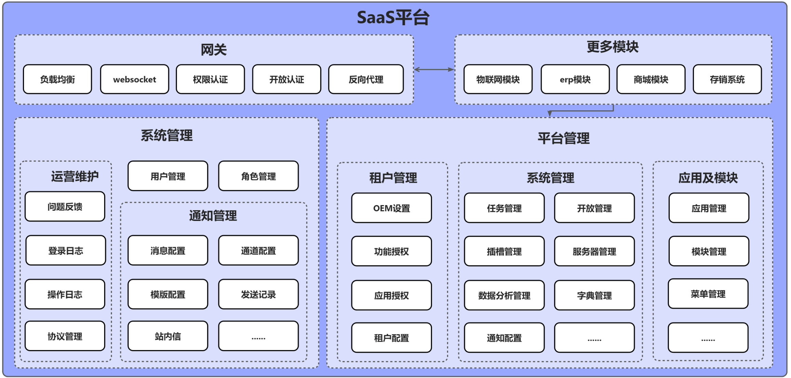
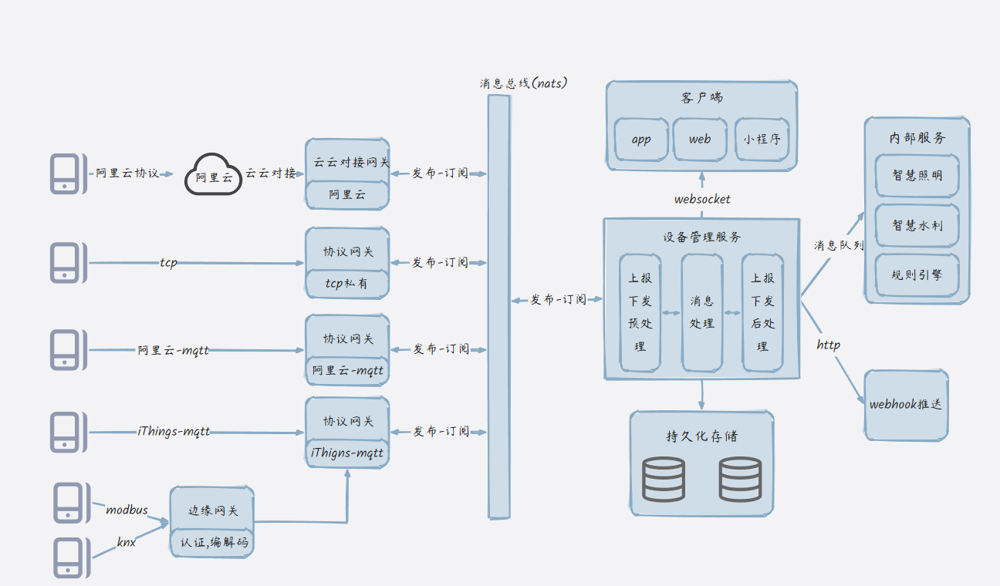
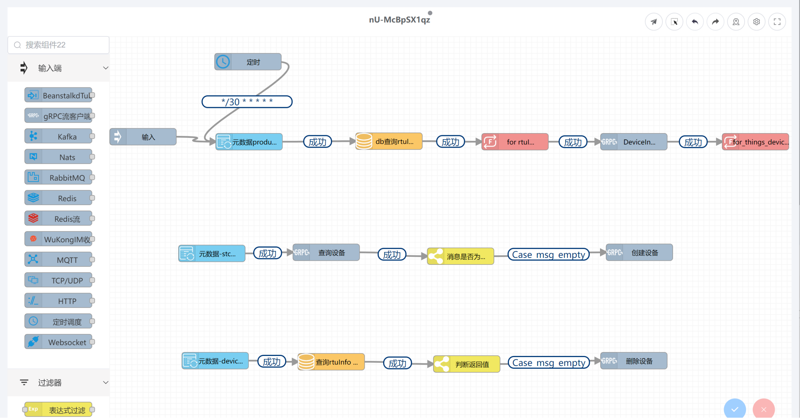
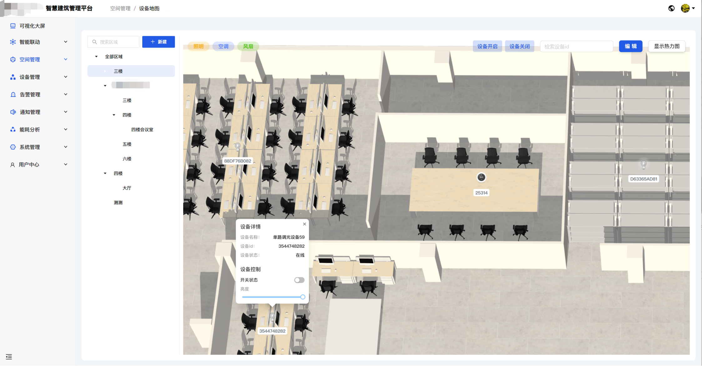

# 联犀 - 企业级物联网平台 | 物联网基座平台

> 📖 [中文](README.md) | [English](README.en.md)

## 🚀 企业级物联网平台

**联犀** 是一款基于 Go 语言开发的商业级 **SaaS物联网平台**，具备 **云原生微服务**、**边缘计算** 能力和 **多租户架构**。这个 **企业级物联网平台** 作为 **物联网基座平台**，提供完整的 **设备管理**、**实时数据分析**、**完善的权限管理体系**、**多场景物联网解决方案** 能力，可广泛应用于 **智慧楼宇**、**智慧城市**、**智慧能源**、**智能家居**、**工业物联网**、**智慧农业**、**智慧医疗** 等众多场景，降低企业开发成本80%。

### 🎯 为什么选择联犀物联网平台？

- ✅ **开箱即用的IoT解决方案**：完整的 **物联网平台**，无需从零搭建
- ✅ **成本低廉的企业级平台**：相比自建平台，节省 80% 开发成本
- ✅ **快速IoT部署**：从项目启动到 **连接设备** 上线，仅需数周时间
- ✅ **完善的权限管理**：企业级 **权限管理体系**，支持细粒度权限控制
- ✅ **持续IoT创新**：活跃的开源社区，**物联网功能** 持续迭代优化

> 📖 [完整文档](https://doc.unitedrhino.com/) | 🌐 [在线体验](https://doc.unitedrhino.com/use/ezkveztg/) 

---

## ✨ 核心物联网平台特性

### 🏢 多租户 & 多项目物联网架构
支持 **多租户物联网解决方案** 和 **多项目管理**，可以低成本承接定制 **物联网项目开发**，满足不同企业的个性化 **连接设备** 需求。支持 **智慧楼宇**、**智慧城市**、**智慧能源**、**智能家居**、**工业物联网**、**智慧农业**、**智慧医疗** 等多场景物联网应用。

### 🔧 灵活物联网部署
一套 **物联网平台代码** 支持 **单体**、**微服务** 及 **集群部署** 模式，最低可以在2G内存的机器上运行，最高可以支持百万 **物联网设备**。

### ⚡ 快速物联网接入
默认支持多种 **物联网协议**（阿里云物联网、腾讯云物联网、涂鸦物联网、电信物联网、Modbus物联网等），同时可以快速接入各种 **物联网通信协议**（MQTT、TCP、UDP、HTTP、LoRaWAN...）。

### 📱 即用型物联网应用
提供商业级 **物联网小程序** 和 **物联网移动应用**，通过简单编辑即可快速上线，无需从零开发 **物联网应用**。

### 🛠️ 快速物联网开发
利用 **微前端技术**，在 **SaaS物联网平台** 上新建 **物联网模块**，仅开发差异化前端代码，大幅提升 **物联网开发** 效率。可快速构建 **智慧楼宇**、**智慧城市**、**智慧能源**、**智能家居**、**工业物联网**、**智慧农业**、**智慧医疗** 等各类物联网应用场景。

### 🌟 一站式物联网基座解决方案
从 **物联网设备软硬件** 到 **云端物联网协议对接** 到 **物联网Web应用** 及 **移动物联网应用** 的全栈式解决方案，覆盖物联网全链路。作为 **物联网基座平台**，可快速构建 **智慧楼宇**、**智慧城市**、**智慧能源**、**智能家居**、**工业物联网**、**智慧农业**、**智慧医疗** 等各类物联网应用场景。

### 🔌 完善的物联网平台功能
灵活的 **OTA升级**、**物联网场景自动化**、**物联网告警管理**、**物联网规则引擎**、**物联网配置大屏**、**物联网物模型**（通用物模型、产品品类物模型、产品物模型、设备物模型）...

### 🏗️ 强大的物联网中台
完善的 **物联网通知机制**（邮箱、短信、微信、企微、飞书、钉钉...），支持第三方用户部门同步，**企业级权限管理体系**，支持细粒度权限控制、角色管理、数据权限管理等。

### 🌐 边缘计算 & 云原生
先进的 **边缘计算** 能力用于 **物联网边缘设备**，**云原生物联网架构** 实现无缝扩展，以及 **实时物联网数据处理**。

## 🏗️ 物联网平台架构

联犀 **物联网平台** 作为 **物联网架构** 中的关键中介和 **物联网基座平台**，实现 **物联网设备** 与 **物联网应用层** 的高效联动。它不仅向下管理 **连接物联网设备**，完成 **物联网数据收集** 和 **物联网数据存储**，而且向上为 **物联网开发者** 和 **物联网集成商** 提供统一的 **物联网数据接口** 和 **物联网开发工具**，加速 **智慧楼宇**、**智慧城市**、**智慧能源**、**智能家居**、**工业物联网**、**智慧农业**、**智慧医疗** 等多场景 **物联网解决方案开发** 和 **物联网部署**。

### 物联网模块架构设计

### SaaS中台架构设计

### 部署架构图

## 物联网平台示例

### 低代码物联网平台

### 物联网组态大屏

### 物联网设备地图

## 💎 物联网平台价值

| 平台价值 | 描述 |
|---------|------|
| **强大的物联网扩展能力** | 支持 **单体** 和 **微服务物联网架构**，便于 **物联网开发者** 在不同发展阶段灵活切换，无需维护两套代码 |
| **高性能物联网** | 使用 **Golang** 开发，依赖的第三方服务少，适应多种 **物联网性能** 要求，可以快速水平扩展 |
| **物联网数据价值** | **私有化物联网部署** 与自主 **物联网数据管理**，无需担心公有云服务中断或成本问题 |
| **物联网基座平台** | 作为 **多场景物联网解决方案** 的数字底座，支持 **智慧楼宇**、**智慧城市**、**智慧能源**、**智能家居**、**工业物联网**、**智慧农业**、**智慧医疗** 等多行业共用 **物联网平台**，沉淀 **物联网行业经验** 和 **物联网产品方案** |

## 🎖️ 谁在使用我们的物联网平台？（部分）

### 物联网合作伙伴展示

|   |   |   |
|---------|---------|---------|
|  福建合创网络科技有限公司 |  深圳市易百珑科技有限公司 |  联远智维 |
|  常州飞诺医疗技术有限公司 |  重庆图浩科技 |  杭州伟立讯 |

## 🛠️ 物联网技术栈

### 物联网后端技术
- **物联网微服务框架**: [go-zero](https://go-zero.dev/) - 高性能 **物联网微服务框架**
- **物联网高性能缓存**: [Redis](https://redis.io/) - 内存 **物联网数据结构** 存储
- **物联网消息队列**: [NATS](https://docs.nats.io/) - 高性能 **物联网消息系统**
- **物联网关系型数据库**: [MySQL/MariaDB](https://mariadb.com/) 或 PostgreSQL
- **物联网服务注册中心**: [etcd](https://etcd.io/) (**物联网微服务** 模式)
- **物联网对象存储**: [MinIO](https://min.io/) 或本地存储阿里云,aws - **云原生物联网对象存储**
- **物联网时序数据库**: [TDengine](https://www.taosdata.com/) 或 timescale - 高性能 **物联网时序数据处理**
- **物联网MQTT服务器**: [EMQX](https://docs.emqx.com/) 或 comqtt - 分布式 **物联网消息服务器**

### 物联网前端技术
- **物联网框架**: [Vue.js](https://cn.vuejs.org/) - 渐进式JavaScript **物联网框架**
- **物联网UI组件**: [Ant Design Vue](https://antdv.com/) - 企业级 **物联网设计组件**

### 物联网移动端
- **物联网小程序**: [uni-app Vue3](https://uniapp.dcloud.net.cn/) - 跨平台 **物联网开发框架**
- **物联网App**: [uni-app X](https://doc.dcloud.net.cn/uni-app-x/) - 支持安卓、iOS、鸿蒙的 **物联网应用**

## 🚀 快速开始物联网平台

### 🎯 5分钟物联网平台体验

想要快速体验联犀的强大 **物联网平台功能**？我们为你准备了完整的 **物联网演示环境**！

#### 🌟 在线物联网演示环境
无需安装，立即体验联犀的完整 **物联网功能**

[🚀 立即体验物联网平台](https://doc.unitedrhino.com/use/ezkveztg/)

### 📋 物联网平台环境要求
- **Go**: 1.19+
- **物联网数据库**: MySQL 5.7+ 或 PostgreSQL
- **物联网缓存**: Redis 6.0+
- **物联网容器**: Docker (可选，推荐)

### 🛠️ 快速物联网平台部署

#### 📚 详细物联网部署指南
从环境准备到 **物联网服务** 启动，一步步带你完成 **物联网平台部署**

[📖 查看物联网部署文档](https://doc.unitedrhino.com/use/046431/)

### 💡 遇到物联网平台问题？

- **📖 查看物联网文档**: [完整物联网文档](https://doc.unitedrhino.com/)
- **🐛 提交物联网Issue**: [GitHub物联网Issues](https://github.com/unitedrhino/things/issues)
- **💬 加入物联网社区**: 扫码加入微信群，获得 **物联网技术支持**

#### 💡 快速获取物联网帮助
遇到 **物联网技术问题**？我们的微信群里有 500+ **物联网开发者**，随时为你解答！

**扫码加入微信群 → 获得即时 **物联网技术支持****

## 💬 联系物联网平台团队

### 📱 物联网微信交流群

> 💬 **群内已有 500+ 物联网开发者，期待你的加入！**

**扫码加入，开启你的 **物联网之旅**！**

### 📢 物联网公众号

关注公众号，获取更多精彩 **物联网内容**：

### 📞 其他物联网联系方式

- **微信**: godLei6
- **物联网官网**: [https://doc.unitedrhino.com/](https://doc.unitedrhino.com/)
- **物联网GitHub Issues**: [提交物联网问题反馈](https://github.com/unitedrhino/things/issues)

## 🤝 物联网开源社区

- **物联网GitHub**: [联犀物联网 GitHub](https://github.com/unitedrhino/things)
- **物联网Gitee**: [联犀物联网 Gitee](https://gitee.com/unitedrhino/things)
- **物联网官网**: [联犀物联网官网](https://doc.unitedrhino.com/)

## 👥 物联网贡献者

感谢所有已经为我们的 **物联网平台** 做出贡献的人!

## 💬 加入我们的物联网社区

### 🎯 为什么加入我们的物联网社区？

- **🚀 获取最新物联网资讯**：第一时间了解 **物联网平台更新** 和新的 **物联网功能** 发布
- **💡 物联网技术交流**：与 **物联网专家**、**物联网开发者** 深度交流 **物联网技术问题**
- **🔧 物联网问题解答**：遇到 **物联网问题**？群里的 **物联网大神们** 随时为你解答
- **🤝 物联网资源共享**：分享 **物联网技术文档**、**物联网最佳实践** 和 **物联网行业案例**
- **🎁 专属物联网福利**：群内用户专享的 **物联网技术支持**、优先体验新的 **物联网功能**
- **📈 物联网职业发展**：结识 **物联网行业** 同仁，拓展人脉资源

### 🌟 物联网社区活动

- **每周物联网技术分享**：邀请 **物联网行业专家** 分享前沿 **物联网技术**
- **物联网产品体验官**：优先体验新的 **物联网功能**，反馈建议
- **物联网开源贡献者计划**：参与 **物联网开源项目**，获得专属荣誉
- **物联网线下技术沙龙**：定期举办线下 **物联网交流** 活动

## ⭐ 收藏物联网项目

> 💡 **提示**: 如需关注最新 **物联网平台** 版本变化，请移步：[Gitee](https://gitee.com/unitedrhino/things)

## 📄 物联网平台许可证

本 **物联网平台** 项目采用 [Apache License 2.0](LICENSE) 开源许可证。

---

## 🚀 开始你的物联网平台之旅

如果这个 **物联网平台** 项目对您有帮助，请给我们一个 ⭐ Star

💬 加入我们的 **物联网社区**，与 500+ **物联网开发者** 一起交流学习

[⭐ Star 物联网平台 on GitHub](https://github.com/unitedrhino/things) | [⭐ Star 物联网平台 on Gitee](https://gitee.com/unitedrhino/things)

*Made with ❤️ by 联犀物联网团队*
