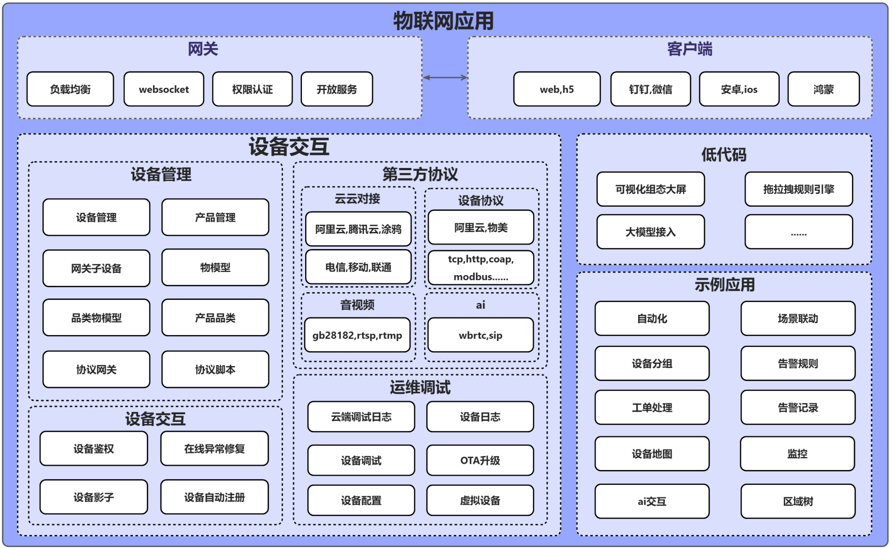
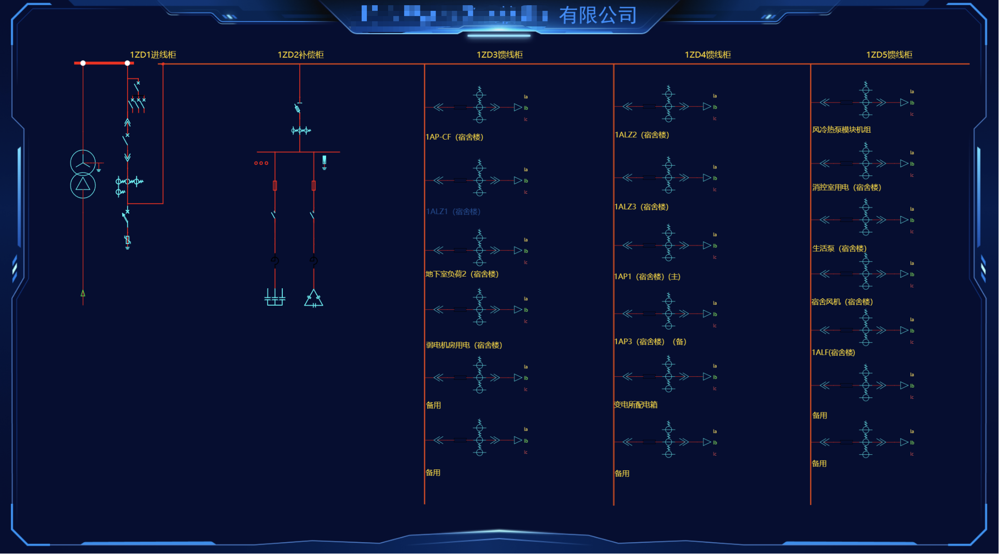

# 联犀 - 物联网专家

## 🚀 产品简介

**联犀** 是一款基于 Go 语言开发的商业级 SaaS 云原生微服务物联网平台，原生多租户多应用，自带完整的小程序，云边协同，可以适用于各种场景，降低企业的开发维护成本。

  <h3 style="margin: 0 0 15px 0; color: white;">🎯 为什么选择联犀？</h3>
  <ul style="margin: 0; padding-left: 20px;">
    <li>✅ <strong>开箱即用</strong>：完整的物联网解决方案，无需从零搭建</li>
    <li>✅ <strong>成本低廉</strong>：相比自建平台，节省 80% 开发成本</li>
    <li>✅ <strong>快速上线</strong>：从项目启动到产品上线，仅需数周时间</li>
    <li>✅ <strong>持续更新</strong>：活跃的开源社区，功能持续迭代优化</li>
  </ul>

> 📖 [完整文档](https://doc.unitedrhino.com/) | 🌐 [在线体验](https://doc.unitedrhino.com/use/ezkveztg/) | 💬 [加入社区](https://doc.unitedrhino.com/community/)

---

## ✨ 核心特性

### 🏢 多租户 & 多项目
支持多租户及多项目，可以低成本接定制项目，满足不同企业的个性化需求。

### 🔧 灵活部署
一套代码支持单体、微服务及集群模式部署，最低可以在2G内存的机器上运行，最高可以支持百万设备。

### ⚡ 快速接入
默认支持多种协议（阿里云、腾讯云、涂鸦、电信、Modbus等），同时可以快速接入各种协议（MQTT、TCP、UDP、HTTP...）。

### 📱 即用型小程序与App
提供商业级小程序和App，通过简单编辑即可快速上线，无需从零开发。

### 🛠️ 快速开发
利用微前端技术，在SaaS平台上新建模块，仅开发差异化前端代码，大幅提升开发效率。

### 🌟 一站式解决方案
从设备软硬件到云端协议对接到Web及移动端全栈式解决方案，覆盖物联网全链路。

### 🔌 完善的物联网功能
灵活的OTA升级、场景联动、告警管理、规则引擎、组态、物模型（通用物模型、产品品类物模型、产品物模型、设备物模型）...

### 🏗️ 强大的中台
完善的通知机制（邮箱、短信、微信、企微、飞书、钉钉...），支持第三方用户部门同步，灵活的权限管理。

## 🏗️ 产品架构

联犀物联网平台作为物联网架构中的关键中介，实现设备与应用层的高效联动。它不仅向下管理物联网设备，完成数据的收集与存储，而且向上为开发者和集成商提供统一的数据接口和工具，加速物联网解决方案的开发和部署。

### 物联网模块架构设计

### SaaS中台架构设计

### 部署架构图

## 部分示例

### 低代码

### 组态大屏

### 设备地图

## 💎 产品价值

| 平台价值 | 描述 |
|---------|------|
| **拓展能力强** | 支持单体和微服务架构，便于开发者在不同发展阶段灵活切换，无需维护两套代码 |
| **高性能** | 使用 Golang 开发，依赖的第三方服务少，适应多种性能要求，可以快速水平拓展 |
| **数据价值** | 私有化部署，数据自主管理，无需担心公有云服务中断或成本问题 |
| **解决方案底座** | 作为行业解决方案的数字底座，支持多行业共用物联网平台，沉淀行业经验和产品方案 |

## 🎖️ 谁在使用我们的产品？（部分）

  

    
    
福建合创网络科技有限公司

  

  

    
    
深圳市易百珑科技有限公司

  

  

    
    
联远智维

  

  

    
    
常州飞诺医疗技术有限公司

  

  

    
    
重庆图浩科技

  

  

    
    
杭州伟立讯

  

## 🛠️ 技术栈

### 后端技术
- **微服务框架**: [go-zero](https://go-zero.dev/) - 高性能微服务框架
- **高性能缓存**: [Redis](https://redis.io/) - 内存数据结构存储
- **消息队列**: [NATS](https://docs.nats.io/) - 高性能消息系统
- **关系型数据库**: [MySQL/MariaDB](https://mariadb.com/) 或 PostgreSQL
- **服务注册中心**: [etcd](https://etcd.io/) (微服务模式)
- **对象存储**: [MinIO](https://min.io/) 或本地存储阿里云,aws  - 云原生对象存储
- **时序数据库**: [TDengine](https://www.taosdata.com/) 或 timescale - 高性能时序数据处理
- **MQTT服务器**: [EMQX](https://docs.emqx.com/) 或 comqtt - 分布式物联网消息服务器

### 前端技术
- **框架**: [Vue.js](https://cn.vuejs.org/) - 渐进式JavaScript框架
- **UI组件**: [Ant Design Vue](https://antdv.com/) - 企业级设计组件

### 移动端
- **小程序**: [uni-app Vue3](https://uniapp.dcloud.net.cn/) - 跨平台开发框架
- **App**: [uni-app X](https://doc.dcloud.net.cn/uni-app-x/) - 支持安卓、iOS、鸿蒙

## 🚀 快速开始

### 🎯 5分钟快速体验

想要快速体验联犀的强大功能？我们为你准备了完整的演示环境！

  <h4 style="margin: 0 0 10px 0; color: #007bff;">🌟 在线演示环境</h4>
  
无需安装，立即体验联犀的完整功能

  <a href="https://doc.unitedrhino.com/use/ezkveztg/" style="background: #007bff; color: white; padding: 10px 20px; text-decoration: none; border-radius: 5px; display: inline-block;">🚀 立即体验</a>

### 📋 环境要求
- **Go**: 1.19+
- **数据库**: MySQL 5.7+ 或 PostgreSQL
- **缓存**: Redis 6.0+
- **容器**: Docker (可选，推荐)

### 🛠️ 快速部署

  <h4 style="margin: 0 0 10px 0; color: #28a745;">📚 详细部署指南</h4>
  
从环境准备到服务启动，一步步带你完成部署

  <a href="https://doc.unitedrhino.com/use/046431/" style="background: #28a745; color: white; padding: 10px 20px; text-decoration: none; border-radius: 5px; display: inline-block;">📖 查看部署文档</a>

### 💡 遇到问题？

- **📖 查看文档**: [完整文档](https://doc.unitedrhino.com/)
- **🐛 提交 Issue**: [GitHub Issues](https://github.com/unitedrhino/things/issues)
- **💬 加入社区**: 扫码加入微信群，获得技术支持

  <h4 style="margin: 0 0 10px 0; color: #856404;">💡 快速获取帮助</h4>
  
遇到技术问题？我们的微信群里有 500+ 物联网开发者，随时为你解答！

  
<strong>扫码加入微信群 → 获得即时技术支持</strong>

## 🤝 开源社区

- **GitHub**: [联犀 GitHub](https://github.com/unitedrhino/things)
- **Gitee**: [联犀 Gitee](https://gitee.com/unitedrhino/things)
- **官网**: [联犀官网](https://doc.unitedrhino.com/)

## 👥 贡献者

感谢所有已经做出贡献的人!

## 💬 加入我们的社区

### 🎯 为什么加入我们的社区？

- **🚀 获取最新资讯**：第一时间了解产品更新、新功能发布
- **💡 技术交流**：与物联网专家、开发者深度交流技术问题
- **🔧 问题解答**：遇到问题？群里的大神们随时为你解答
- **🤝 资源共享**：分享技术文档、最佳实践、行业案例
- **🎁 专属福利**：群内用户专享的技术支持、优先体验新功能
- **📈 职业发展**：结识行业同仁，拓展人脉资源

### 📱 微信交流群

> 💬 **群内已有 500+ 物联网开发者，期待你的加入！**

**扫码加入，开启你的物联网之旅！**

### 📢 公众号

关注公众号，获取更多精彩内容：

### 🌟 社区活动

- **每周技术分享**：邀请行业专家分享物联网前沿技术
- **产品体验官**：优先体验新功能，反馈建议
- **开源贡献者计划**：参与开源项目，获得专属荣誉
- **线下技术沙龙**：定期举办线下交流活动

### 📞 其他联系方式

- **微信**: godLei6
- **官网**: [https://doc.unitedrhino.com/](https://doc.unitedrhino.com/)
- **GitHub Issues**: [提交问题反馈](https://github.com/unitedrhino/things/issues)

## ⭐ 收藏项目

::: tip 💡 提示
如需关注最新版本变化，请移步：[Gitee](https://gitee.com/unitedrhino/things)
:::

## 📄 许可证

本项目采用 [Apache License 2.0](LICENSE) 开源许可证。

---

  <h3 style="margin: 0 0 20px 0; color: #333;">🚀 开始你的物联网之旅</h3>
  
如果这个项目对您有帮助，请给我们一个 ⭐ Star

  
💬 加入我们的社区，与 500+ 物联网开发者一起交流学习

  

    <a href="https://github.com/unitedrhino/things" style="background: #333; color: white; padding: 10px 20px; text-decoration: none; border-radius: 5px;">⭐ Star on GitHub</a>
    <a href="https://gitee.com/unitedrhino/things" style="background: #c71d23; color: white; padding: 10px 20px; text-decoration: none; border-radius: 5px;">⭐ Star on Gitee</a>
  

  
Made with ❤️ by 联犀团队

