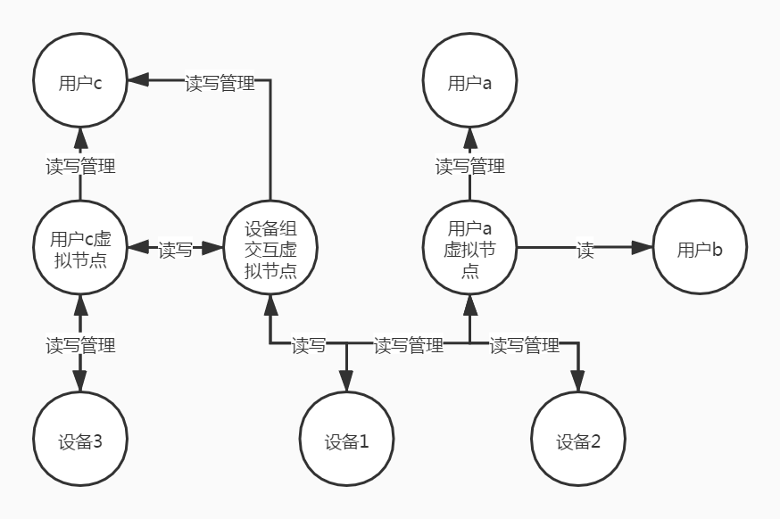

# 设备与用户交互方案

## 简介

由于在物联网平台中需要直接打通用户与设备，设备与设备之间的交互.  
同时在很多场景中一个设备对应多个人，一个人对应多个设备，设备也会和多个设备交互.  
所以需要设计以满足以上需求的方案

## 设计思路

由于设备也好，人也好，其实都是需要实现多对多的交互逻辑，所以在实现这个能力的时候其实可以在底层将人和设备都抽象成为用户  
在这样的思路下自然会参考最热的聊天软件，在其中找寻灵感.  
在微信中，用户和用户可以私聊，只要互为好友.同时在微信群中不是好友的用户也可以互相聊天  
而私聊方案符合我们的设备需要绑定到人的这个逻辑，而微信群则符合人可以把人拉进群，把设备拉进群，就可以实现多对多交互  
由于私聊方案在物联网平台中其实只起到了一个权限认证的功能，私聊其实也相当于一个两个用户的群聊，所以私聊默认只进行权限认证  
而群组呢本质上也是权限系统，可以允许群组成员查看对方的历史记录，以及订阅最新消息  
群组中的设备默认是可以互相订阅最新消息及查看对应的设备信息  
如果要实现光设备与设备的多对多的交互则需要有管理员的角色来拉起这么一个组  
之后的低代码功能可以基于以上的权限系统将消息流转到每一个组员，避免发送到不相干的用户那

## 方案1:基于组实现

* 角色
    * 组: 组内的成员可以互相拉取对方的最新及历史消息
    * 管理员: 创建群组的主人，一个群只有一个管理员，拥有管理群组成员的权限，可以添加自己旗下的设备及拉入其他人
    * 主人: 可以绑定设备，拥有创建组的权限 及向自己所在的组中 添加自己旗下的设备，可以是人，也可以是网关设备
    * 普通成员: 可以拉取设备的最新及历史消息
* 群组成员权限
    * 权限共控制:管理员:组成员:设备
    * 权限为:读权限(组中成员都有)，写权限(管理员及主人对旗下的设备默认拥有写权限)

## 方案2:基于设备树实现

追随与linux的设计哲学，一切皆是文件，在这个方案中一切设备，人，网关都是节点

* 角色
    * 节点: 可以是设备，也可以是人，也可以是虚拟的节点
        * 设备可以挂载在任意节点上
        * 节点的最顶层需要是人或网关
        * 用户绑定的设备和用户之前会添加个虚拟节点
        * 每个节点绑定一个管理节点，只有管理节点拥有添加删除旗下节点的权限
    * 组: 组内的成员可以互相拉取对方的最新及历史消息
    * 授权: 可以将设备及组的读，写及读写权限授权给一个节点
* 方案解释
    * 通过授权的方式可以通过虚拟节点将多个组或多个设备进行互相交互
    *

